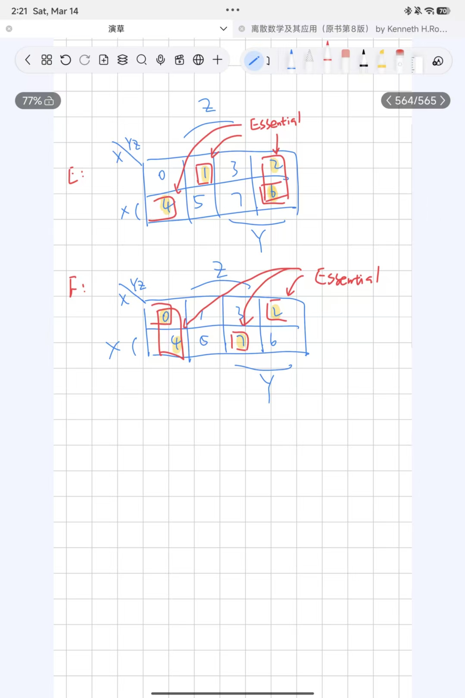
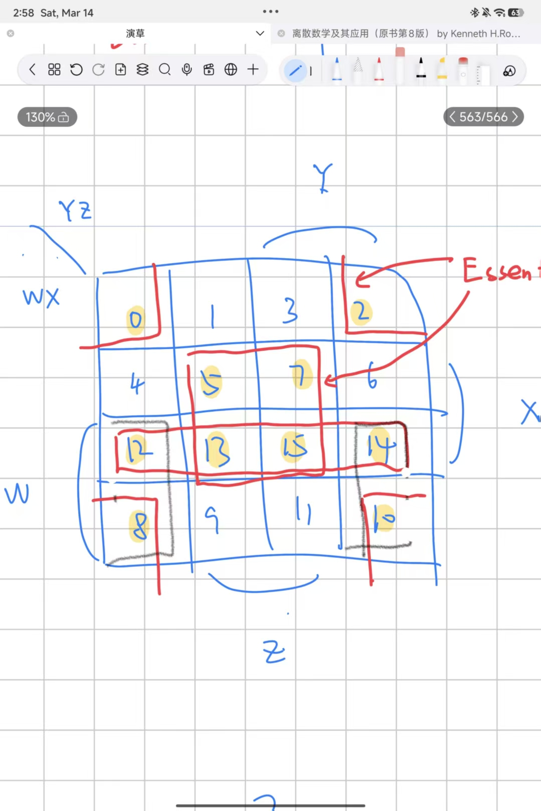
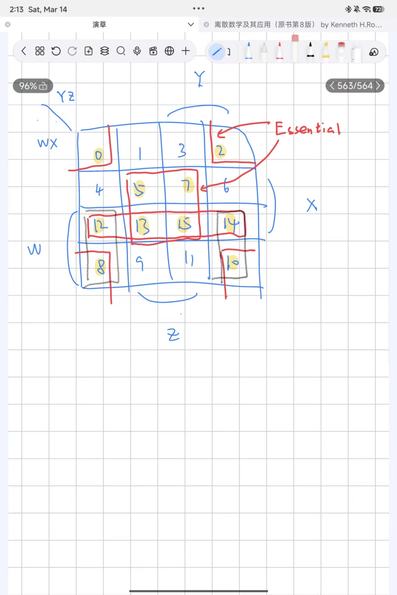
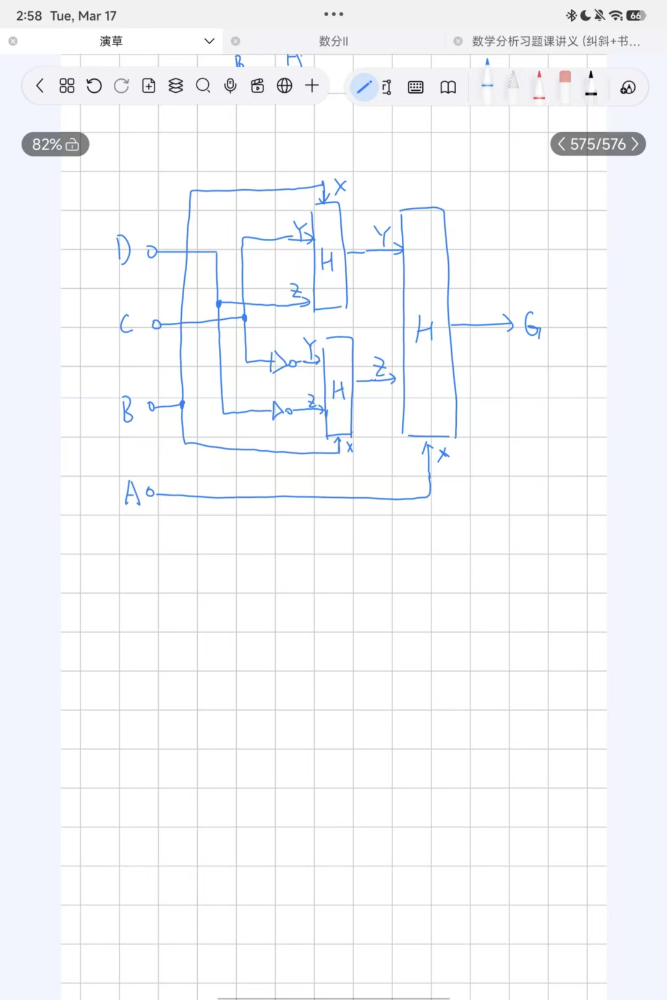
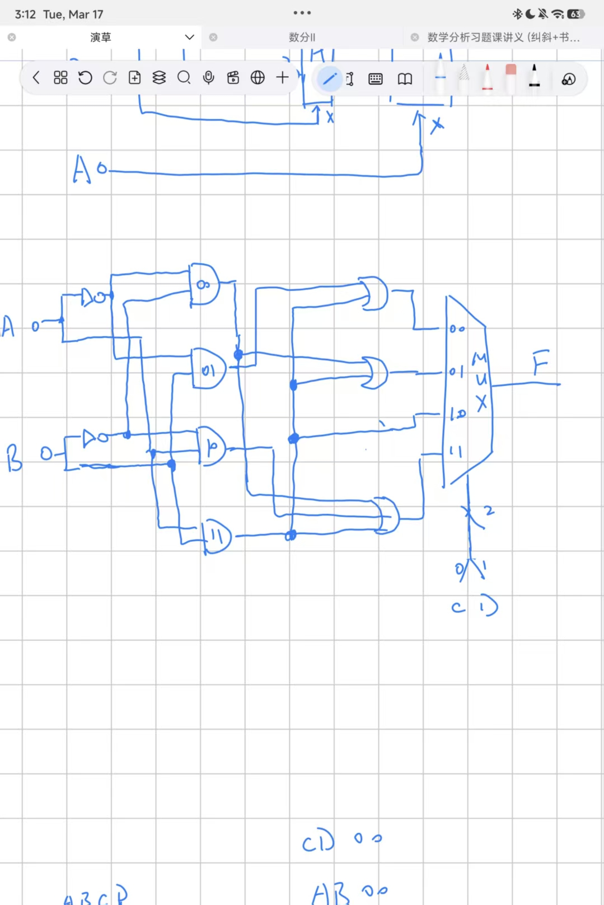
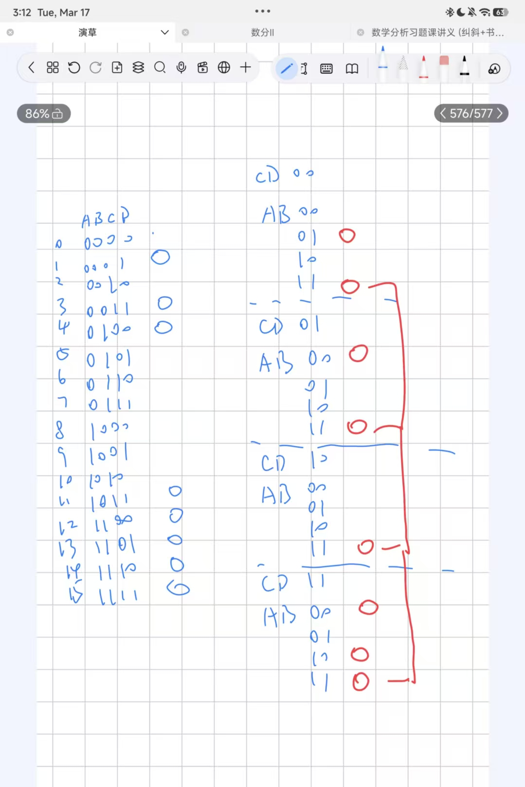
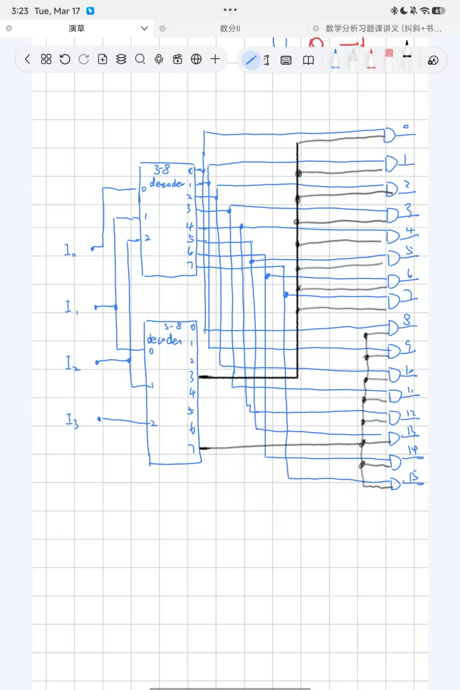
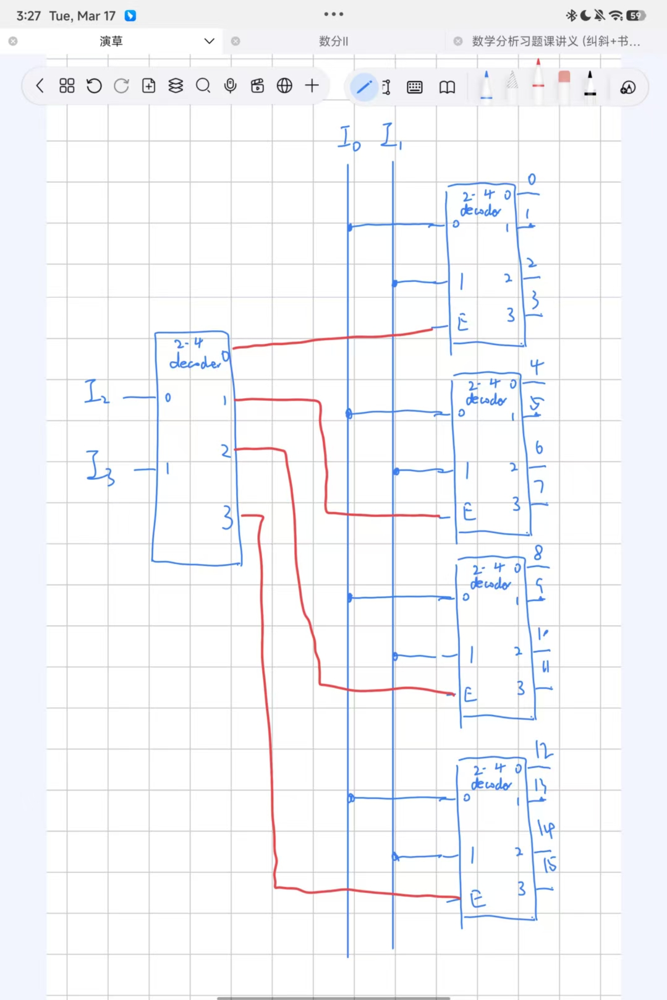
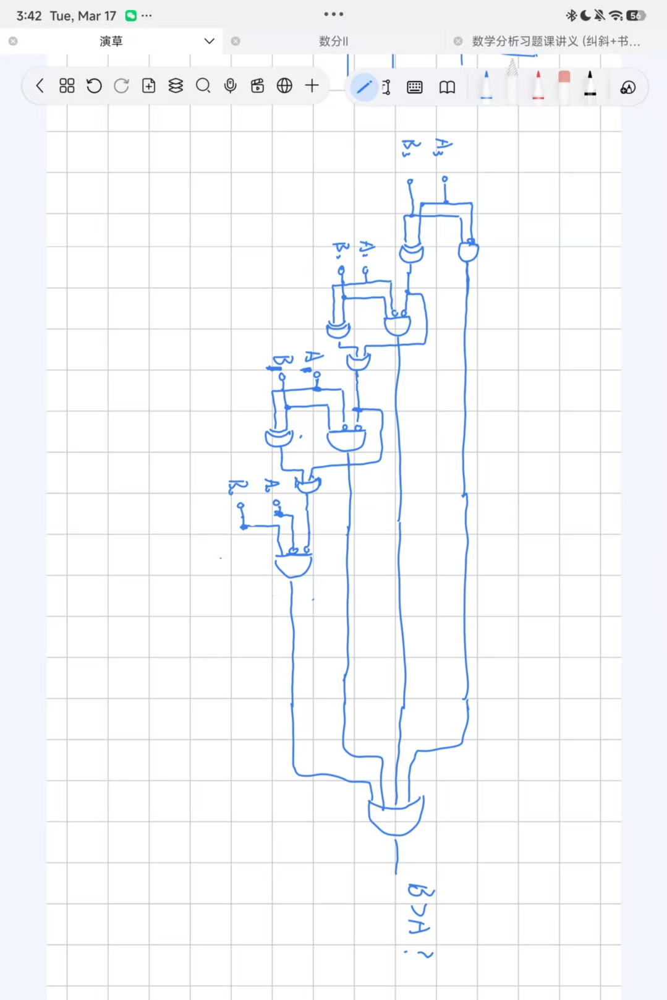

# 系统Ⅰ习题

## 1-1
Convert the following numbers from the given base to the other three bases listed in the table:

| Decimal | Binary | Octal | Hexadecimal |
|---------|--------|-------|-------------|
| 369.3125 | 101110001.0101 | 561.24 | 171.5 |
| 189.625 | 10111101.101 | 275.5 | BD.A |
| 214.625 | 11010110.101 | 326.5 | D6.A |
| 62407.625 | 1111001111000111.101 | 171707.5 | F3C7.A |

## 1-2
In each of the following cases, determine the radix $r$:

$$
(\mathrm{a})\ (\mathrm{BEE})_r = (2699)_{10}
$$
$$
(\mathrm{b})\ (365)_r = (194)_{10}
$$

$(a)$

$11r^2+14r+14=2699$, so $r=15$.

$(b)$

$3r^2+6r+5=194$, so $r=7$.

## 2-1
For the Boolean functions $E$ and $F$, as given in the following truth table:

| $X$ | $Y$ | $Z$ | $E$ | $F$ |
|------|------|------|------|------|
| 0 | 0 | 0 | 0 | 1 |
| 0 | 0 | 1 | 1 | 0 |
| 0 | 1 | 0 | 1 | 1 |
| 0 | 1 | 1 | 0 | 0 |
| 1 | 0 | 0 | 1 | 1 |
| 1 | 0 | 1 | 0 | 0 |
| 1 | 1 | 0 | 1 | 0 |
| 1 | 1 | 1 | 0 | 1 |

(a) List the minterms and maxterms of each function.  
(b) List the minterms of $\overline{E}$ and $\overline{F}$  
(c) List the minterms of $E + F$ and $E \cdot F$.  
(d) Express $E$ and $F$ in sum-of-minterms algebraic form.  
(e) Simplify $E$ and $F$ to expressions with a minimum of literals.

$(a)$

Minterms:

$E=m(1,2,4,6)$

$F=m(0,2,4,7)$

Maxterms:

$E=M(0,3,5,7)$

$F=M(1,3,5,6)$

$(b)$

$\overline{E}=m(0,3,5,7)$

$\overline{F}=m(1,3,5,6)$

$(c)$

$E+F=m(0,1,2,4,6,7)$

$E\cdot F=m(2,4)$

$(d)$

$E=\overline{X}\overline{Y}Z+\overline{X}Y\overline{Z}+X\overline{YZ}+XY\overline{Z}$

$F=\overline{XYZ}+\overline{X}Y\overline{Z}+X\overline{YZ}+XYZ$

$(e)$

$E=\overline{XY}Z+Y\overline{Z}+X\overline{Z}=\overline{XY}Z+\overline{Z}(X+Y)$

$F=\overline{YZ}+\overline{XZ}+XYZ=\overline{Z}(\overline{Y}+\overline{X})+XYZ$



## 2-2
Find all the prime implicants for the following Boolean functions, and determine which are essential:
$$
F(W,X,Y,Z) = \Sigma m(0,2,5,7,8,10,12,13,14,15)
$$

prime implicants: $m(0,2,8,10),m(5,7,13,15),m(12,13,15,14),m(12,8,14,10)$

essential: $m(0,2,8,10),m(5,7,13,15)$



## 2-3
Prove the identity of the following Boolean equation (a), using algebraic manipulation (只做 a):

$(a)$
$$
AB\overline{C} + B\overline{C}\overline{D} + BC + \overline{C}D = B + \overline{C}D
$$

$(b)$
$$
WY + \overline{W}YZ + WXZ + \overline{W}X\overline{Y} = WY + \overline{W}XZ + \overline{X}YZ + X\overline{Y}Z
$$

$(c)$
$$
A\overline{D} + \overline{A}B + \overline{C}D + \overline{B}C = (\overline{A} + \overline{B} + \overline{C} + \overline{D})(A + B + C + D)
$$

$(a)$

$$
\begin{aligned}
AB\overline{C}+B\overline{CD}+BC+\overline{C}D&=AB\overline{C}(D+\overline{D})+b\overline{CD}+BC+\overline{C}D\\
&=AB\overline{C}D+B\overline{CD}+BC+\overline{C}D\\
&=B\overline{CD}+BC+\overline{C}D\\
&=B\overline{CD}+BC(D+\overline{D})+\overline{C}D(B+1)\\
&=B\overline{CD}+BCD+BC\overline{D}+B\overline{C}D+\overline{C}D\\
&=B+\overline{C}D
\end{aligned}
$$

## 2-4
Optimize the following Boolean functions $F$ together with the don't-care conditions $d$. Find all prime implicants and essential prime implicants, and apply the selection rule.
$$
F(W,X,Y,Z) = \Sigma m(0,2,4,5,8,14,15),\quad d(W,X,Y,Z) = \Sigma m(7,10,13)
$$

prime implicants: $m(0,2,8,10),m(5,7,13,15),m(0,4),m(4,5),m(15,14),m(14,10)$

essential prime implicants: $m(0,2,8,10)$

selective ones: $m(4,5),m(15,14)$



## 3-1
A hierarchical component with the function
$$
H = \bar{X}Y + XZ
$$
is to be used along with inverters to implement the following equation:
$$
G = \bar{A}\bar{B}C + \bar{A}BD + A\bar{B}\bar{C} + AB\bar{D}
$$
The overall circuit can be obtained by using Shannon's expansion theorem,
$$
F = \bar{X}F_0(X) + XF_1(X)
$$
where $F_0(X)$ is $F$ evaluated with variable $X = 0$ and $F_1(X)$ is $F$ evaluated with variable $X = 1$. This expansion $F$ can be implemented with function $H$ by letting $Y = F_0$ and $Z = F_1$. The expansion theorem can then be applied to each of $F_0$ and $F_1$ using a variable in each, preferably one that appears in both true and complemented form. The process can then be repeated until all $F_i$'s are single literals or constants.

For $G$, use $X = A$ to find $G_0$ and $G_1$ and then use $X = B$ for $G_0$ and $G_1$. Draw the top-level diagram for $G$ using $H$ as a hierarchical component.

$G=\overline{A}(\overline{B}C+BD)+A(\overline{B}\overline{C}+B\overline{D})$

So $G_0=\overline{B}C+BD,G_1=\overline{B}\overline{C}+B\overline{D}$

Applying Shannon's expansion to $G_0,G_1$ won't change the way they look.

Top-level diagram:



## 3-2
Implement the Boolean function
$$
F(A,B,C,D) = \Sigma m(1,3,4,11,12,13,14,15)
$$
with a 4-to-1-line multiplexer and external gates. Connect inputs A and B to the selection lines. The input requirements for the four data lines will be a function of the variables C and D. The values of these variables are obtained by expressing F as a function of C and D for each of the four cases when $AB = 00, 01, 10,$ and 11. These functions must be implemented with external gates.





## 3-3
(a) Design a 4-to-16-line decoder using two 3-to-8-line decoders and 16 2-input AND gates.  
(b) Design a 4-to-16-line decoder with enable using five 2-to-4-line decoders with enable.

$(a)$



$(b)$



## 3-4
Design a combinational circuit that compares two 4-bit unsigned numbers A and B to see whether B is greater than A. The circuit has one output X, so that $X = 1$ if $A < B$ and $X = 0$ if $A \geq B$.



---

## 4-1

3.20
$< 3.5>$ What decimal number does the bit pattern $0\times 0C000000$ represent if it is a two's complement integer? An unsigned integer?

3.21
$< 3.5>$ If the bit pattern $0\times 0C000000$ is placed into the Instruction Register, what MIPS instruction will be executed?

3.22
$< 3.5>$ What decimal number does the bit pattern $0\times 0C000000$ represent if it is a floating point number? Use the IEEE 754 standard.

3.23
$< 3.5>$ Write down the binary representation of the decimal number 63.25 assuming the IEEE 754 single precision format.

3.24
$< 3.5>$ Write down the binary representation of the decimal number 63.25 assuming the IEEE 754 double precision format.

4-2
3.27 $< 3.5>$ IEEE 754-2008 contains a half precision that is only 16 bits wide. The leftmost bit is still the sign bit, the exponent is 5 bits wide and has a bias of 15, and the mantissa is 10 bits long. A hidden 1 is assumed. Write down the bit pattern to represent $-1.5625\times 10^{-1}$ assuming a version of this format, which uses an excess-16 format to store the exponent. Comment on how the range and accuracy of this 16-bit floating point format compares to the single precision IEEE 754 standard.

---

## 5-1
A sequential circuit has one flip-flop Q, two inputs X and Y, and one output S. The circuit consists of a D flip-flop with S as its output and logic implementing the function $D = X \oplus Y \oplus S$ with D as the input to the D flip-flop. Derive the state table and state diagram of the sequential circuit.

## 5-2
Design a sequential circuit with two D flip-flops A and B and one input X. When $X = 0$, the state of the circuit remains the same. When $X = 1$, the circuit goes through the state transitions from 00 to 10 to 11 to 01, back to 00, and then repeats.

## 5-3
A pair of signals Request $(R)$ and Acknowledge $(A)$ is used to coordinate transactions between a CPU and its I/O system. The interaction of these signals is often referred to as a "handshake." These signals are synchronous with the clock and, for a transaction, are to have their transitions always appear in the order shown in Figure 4-53. A handshake checker is to be designed that will verify the transition order. The checker has inputs, $R$ and $A$, asynchronous reset signal, RESET, and output, Error $(E)$. If the transitions in a handshake are in order, $E = 0$. If the transitions are out of order, then $E$ becomes 1 and remains at 1 until the asynchronous reset signal (RESET $= 1$) is applied to the CPU.

image[[232, 538, 748, 666]]

(a) Find the state diagram for the handshake checker.  
(b) Find the state table for the handshake checker.

## 5-4
Use $D$-type flip-flops and gates to design a counter with the following repeated binary sequence: 0, 2, 1, 3, 4, 6, 5, 7.

---

## 5-5
Draw the logic diagram of a 4-bit register with mode selection inputs $S1$ and $S0$. The register is to be operated according to the function table below.

| $S1$ | $S0$ | Register Operation |
|-------|-------|-------------------|
| 0     | 0     | No change         |
| 0     | 1     | Complement output |
| 1     | 0     | Load parallel data |
| 1     | 1     | Clear register to 0 |

## 5-6
A register cell is to be designed for an 8-bit register $A$ that has the following register transfer functions:
$$
C_0: A \leftarrow A \cap B,\quad C_1: A \leftarrow A \cup \overline{B}
$$
Find optimum logic using AND, OR, and NOT gates for the $D$ input to the $D$ flip-flop in the cell.

## 5-7
Two register transfer statements are given (otherwise, R1 is unchanged):
equation[[333, 436, 661, 474]]
(a) Using a 4-bit adder plus external gates as needed, draw the logic diagram that implements these register transfers.

## 5-8
A sequential circuit is shown in the following. The timing parameters for the gates and flip-flops are as follows:
- Inverter: $t_{\mathrm{pd}} = 0.01$ ns
- XOR gate: $t_{\mathrm{pd}} = 0.04$ ns
- Flip-flop: $t_{\mathrm{pd}} = 0.08$ ns, $t_{\mathrm{s}} = 0.02$ ns, and $t_{\mathrm{h}} = 0.01$ ns

(a) Find the longest path delay from an external circuit input passing through gates only to an external circuit output.  
(b) Find the longest path delay in the circuit from an external input to positive clock edge.  
(c) Find the longest path delay from positive clock edge to output.  
(d) Find the longest path delay from positive clock edge to positive clock edge.  
(e) Determine the maximum frequency of operation of the circuit in megahertz (MHz).

---

## 6-1
2.12 [5] $< \S\S 2.2, 2.5>$ Provide the instruction type and assembly language instruction for the following binary value:
$$
0000\ 0000\ 0001\ 0000\ 1000\ 0000\ 1011\ 0011_{\mathrm{two}}
$$

## 6-2
2.13 [5] $< \S\S 2.2, 2.5>$ Provide the instruction type and hexadecimal representation of the following instruction:
$$
\mathrm{sd}\times 5,32(\times 30)
$$

## 6-3
2.31 [20] $< \S 2.8>$ Translate function f into RISC-V assembly language. Assume the function declaration for g is int g(int a, int b). The code for function f is as follows:
```c
int f(int a, int b, int c, int d) {
    return g(g(a, b), c + d);
}
```

## 6-4
2.35 Consider the following code:

```text
lb x6, 0(x7)
sd x6, 8(x7)
```
Assume that the register x7 contains the address $0\times 10000000$ and the data at address is $0\times 1122334455667788$.

2.35.1 [5] $< \S 2.3, 2.9>$ What value is stored in $0\times 10000008$ on a big-endian machine?

2.35.2 [5] $< \S 2.3, 2.9>$ What value is stored in $0\times 10000008$ on a little-endian machine?

## 6-6
2.36 [5] $< \S 2.10>$ Write the RISC-V assembly code that creates the 64-bit constant $0\times 1122334455667788_{\mathrm{two}}$ and stores that value to register x10.

## 7-1

4.13
Examine the difficulty of adding a proposed ss rs1, rs2, imm (Store Sum) instruction to RISC-V.

Interpretation: Mem[Reg[rs1]] = Reg[rs2] + immediate

4.13.1 [10] $< \S 4.4>$ Which new functional blocks (if any) do we need for this instruction?

4.13.2 [10] $< \S 4.4>$ Which existing functional blocks (if any) require modification?

4.13.3 [5] $< \S 4.4>$ What new data paths do we need (if any) to support this instruction?

4.13.4 [5] $< \S 4.4>$ What new signals do we need (if any) from the control unit to support this instruction?

4.13.5 [5] $< \S 4.4>$ Modify Figure 4.21 to demonstrate an implementation of this new instruction.