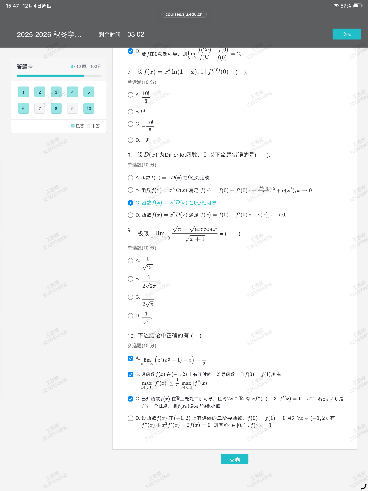
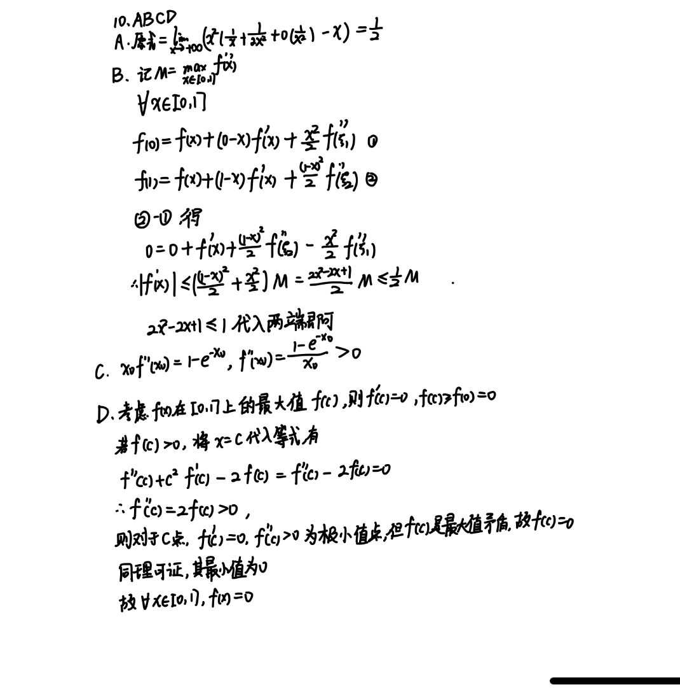

## 前言

个人主观感受，这次小测比上次更难，尤其是多选题。＞︿＜

解析中不仅有做法，对于较难的题目还会讲解做法是怎么想出来的（也就是思路）。然而这也导致文章又臭又长（悲），不过过程其实还是蛮简洁的，只要把我的思路部分去掉的话。

不太确定小测题目有没有版权保护，所以让我先声明一下：

本解析由学生个人整理，仅供参考，并非官方答案。如有疏漏，欢迎指正，版权归课程教师所有。

发布前已经征得任课教师同意。

## 题目

感谢 @想不出来好id 同学提供的截图。

## 答案速查

1. CD

2. D
   
3. D

4. A

5. D

6. AB

7. C

8. B

9. A

10. ABCD

## 解析

### 1

选项 A。这是经典错误结论，直观的反例构造思路是，我可能 $f$ 在 $(0,1)$ 上小振幅高频率波动。

这个反例可以记忆一下：$f(x)=x\sin\dfrac1x,f'(x)=\sin\dfrac1x-\dfrac1x\cos\dfrac1x$。

选项 B。错得比较明显，因为我们只有对二阶导有界的条件，而你任意选一个二阶导，大概率都能积分回去得到原函数。

比方说我们这样构造反例：取 $f''(x)=2$，则其中一个 $f'(x)=2x$，其中一个 $f(x)=x^2$。

选项 C。这是正确的（并不显然）。直观感受是考虑逆否命题，如果导函数是有界的，那么给它积分回去，原函数在一个有限的区间上变化也不会太大。

考虑严格证明。

为了构建 $f$ 和 $f'$ 的关系，我们想到微分中值定理。

考虑取一个固定的 $x_0\in(0,1)$，和一个变化的 $x\in(0,1)$。

由拉格朗日中值定理，在 $x_0,x$ 之间存在一个 $\xi$，使得 $|f'(\xi)|=|\dfrac{f(x)-f(x_0)}{x-x_0}|\ge|f(x)-f(x_0)|\ge|f(x)|-|f(x_0)|$。

而因为 $f(x)$ 无界，所以对任意大的 $M$，都存在 $x$，使得 $f(x)>M$。

而 $|f(x_0)|$ 是个定值，所以对任何一个 $M'$，取 $M=M'+|f(x_0)|$，那么有 $|f'(\xi)|\ge M'$，也就是说 $f'$ 无界。

选项 D。这个选项并不容易，我们先给一个解法，再说心路历程。

由连续函数介值性定理，存在 $x_0\in(0,1),f(x_0)=\dfrac12$。

分别记 $k_0,k_1$ 为 $(x_0,\dfrac12)$ 与 $(0,0),(1,1)$ 之间的斜率。

那么 $\dfrac1{k_0}=2x_0,\dfrac1{k_1}=2(1-x_0)$。

所以 $\dfrac1{k_0}+\dfrac1{k_1}=2$，这跟我们想要的很接近了！

再使用拉格朗日中值定理，存在 $x_1,x_2\in(0,1),f'(x_1)=k_0,f'(x_2)=k_1$，也就是说 $\dfrac1{f'(x_1)}+\dfrac1{f'(x_2)}=2$。

证法很巧妙，怎么想到的呢？

我当时先想了想 $f(x)=x$ 这样简单的例子，然后我觉得，因为我们对导数没有任何了解，所以我们大概率要用拉格朗日转换一下，那我们现在要考虑的，就变成了找到两个斜率 $k_0,k_1$ 满足题中的柿子。

如果你直接开做，你会设出四个变量来，是很难解的。因为题目具有极好的对称性，所以我们猜测，这两个斜率一定是 $(0,0)$ 到某个 $(x_0,f(x_0))$，以及同一个 $(x_0,f(x_0))$ 到某个 $(1,f(1))$。

有了这样的猜测，我们就可以解方程了！

$$
\dfrac{x_0}{f(x_0)}+\dfrac{1-x_0}{1-f(x_0)}=2\\
x_0(1-f(x_0))+(1-x_0)f(x_0)=2f(x_0)(1-f(x_0))\\
x_0(1-2f(x-0))=f(x_0)(1-2f(x_0))\\
(x_0-f(x-0))(1-2f(x_0))=0\\
$$

这说明要么 $f(x_0)=x_0$，要么 $f(x_0)=\dfrac12$。

但是满足 $f(x_0)=x_0$ 的 $x_0$ 不一定存在（别忘了 $x_0$ 不能取端点值！），然而 $f(x_0)=\dfrac12$ 一定存在。

我们再把这个过程倒着写，就得到严谨的过程了。

### 2

这个看起来就像是泰勒展开，甭管能不能做，先展一下肯定不亏。（泰勒 666）

$$
e^x=1+x+\dfrac12x^2+o(x^2)
$$

$$
e^{-\frac{x^2}6}=1-\dfrac{x^2}6+\dfrac1{72}x^4+o(x^4)
$$

$$
xe^{-\frac{x^2}6}=x-\dfrac16x^3+\dfrac1{72}x^5+o(x^5)
$$

而

$$
\sin x=x-\dfrac16x^3+\dfrac{1}{240}x^5+o(x^5)
$$

所以

$$
xe^{-\frac{x^2}6}-\sin x=\dfrac1{180}x^5+o(x^5)
$$

常见的问题是，凭什么展开就展开到 $x^5$ 为止呢？答案是因为两式相减之后，第一个非零项是 $x^5$。

那我们要追问了：你怎么知道是 $x^5$ 呢？答案是我们不知道，所以我们只能尝试。（但是展开次数更高肯定不会错，只是很难算而已）（这也不是说真的让你一直展开下去）

### 3

最直接的办法是，我们把每个选项写成分段函数的形式，然后计算两边的导数，之后无论使用导数极限定理（是叫这个名字吗）还是用定义去算 $f'(0)$ 都可以。

更快的办法是，$\cos x$ 是偶函数，所以 BC 的绝对值相当于白套，而我们知道不套绝对值的情况下，它们在 $0$ 处可导。

然后去算一下 A 发现可导，所以 D 一定不可导。

事实上我们是能感觉出来 D 不太对的。

### 4

直观感受告诉我们，在 $0$ 附近 $f$ 增长得比 $g$ 更慢。

稍微画两条斜率不同的直线，我们就能知道 A 选项是正确的。

（因为这是单选题，所以我们可以放心选 A。这是特殊值法，两条直线是满足题目中 $f,g$ 得要求的。）

下面严格证明一下。

两个函数是不好处理的，我们喜欢一个函数。因为我们只关心两个函数的相对大小关系，所以以下的构造函数思路是自然且常见的。

构造函数 $F(x)=f(x)-g(x)$，则 $F(0)=0,F'(0)<0$。

$$
\lim_{x\to0}\dfrac{F(x)}x=F'(0)<0
$$

由保号性，存在去心邻域 $U^\circ(0)$，使得 $\dfrac{F(x)}{x}<0$。

那就是说当 $x<0$ 时 $F(x)>0$，$x>0$ 时 $F(x)<0$。

### 5

$(1)$

一致连续性，有一个并不严谨的直观感受（但是往往很有效）：函数在 $x$ 的变化不太大的时候，$y$ 的变化也不太大。换句话说，如果 $f'(x)$ 有界，那么原函数一致连续。可如果 $f'(x)$ 无界呢？我们猜测原函数不是一致连续的。

证明一下。假设一致连续。

取一个 $\epsilon$，那么会有对应的 $\delta$，使得如果 $|x_1-x_2|<\delta$，那么 $|f(x_1)-f(x_2)|<\epsilon$。

仍然考虑使用中值定理构造矛盾。

考虑任取 $x_0<x_1=x_0+\Delta,\Delta<\delta$，那么存在 $\xi\in(x_0,x_0+\Delta)$

$$
\dfrac{f(x_1)-f(x_0)}{\Delta}=f'(\xi)
$$

换言之

$$
|f(x_1)-f(x_0)|=|f'(\xi)|\Delta
$$

我们怎么构造矛盾呢？显然是通过让这个柿子变大的方法。

怎么让这个柿子变大呢？改 $\Delta$ 不行，因为 $\Delta<\delta$，所以，如果我们控制住 $\Delta$ 不变，让 $|f'(\xi)|$ 变大就好了。

（事实上这是完全可行的！因为我们知道 $\lim\limits_{x\to+\infty}f'(x)=\infty$）

由这个极限，我们知道对任何 $M$，存在 $\delta'$，使得 $\forall \xi>\delta$ 时，$|f'(\xi)|>M$。为了控制 $|f'(\xi)|$，我们只需要控制 $\xi$。

但是我们不能直接控制 $\xi$，我们只知道 $\xi\in(x_0,x_0+\Delta)$，但是我们不知道具体是谁。

不过 $x_0$ 是我们自己选的！我们取 $x_0>\delta'$，就有 $\xi>\delta'$，就有 $|f'(\xi)|>M$。

只需要取 $M=\dfrac{\epsilon}{\Delta}$，我们就有 $|f(x_1)-f(x_0)|=|f'(\xi)|\Delta>\epsilon$，矛盾。

终于证完了！

$(2)$

采用跟之前一样的，对一致连续的理解，我们发现，当 $x$ 相对小的时候 $f'$ 可能很大，但是由于这样的 $x$ 的长度是有限的，所以 $f$ 一致连续；当 $x$ 相对大的时候 $f'$ 是有界的，所以增长也不会太离谱，$f$ 也是一致连续。而 $f$ 在有交集的两个区间上一致连续，那么它在它们的并上也一致连续。

好长一段话！

剩下的过程是，把这个思路翻译成严格的证明。

由局部有界性，存在 $\delta,M$，使得当 $x>\delta$ 时有 $|f'(x)|<M$。

先证在 $[\delta-1,+\infty)$ 上一致连续。

$\forall \delta-1\le x_1<x_2$，存在 $\xi\in(x_1,x_2)$，使得 $|\dfrac{f(x_2)-f(x_1)}{x_2-x_1}|=|f'(\xi)|<M$，也就是说 $|f(x_2)-f(x_1)|<M|x_2-x_1|$，所以一致连续。

再证在 $[0,\delta-1]$ 上一致连续。这是闭区间上的连续函数，所以一致连续。

综合上述两条，在 $[0,+\infty)$ 一致连续。

$(3)$

我们先说证明再说思路。

所求是 $\dfrac{\infty}{\infty}$ 型极限，使用 L'Hospital 法则

$$
\lim_{x\to+\infty}\dfrac{f(x)}x=\lim_{x\to+\infty}f'(x)=0
$$

下面是碎碎念环节。

场上我犹豫了很久，因为我们在离散的情况下，如果一个数列的项趋于 $0$，它的和不一定趋于 $0$。考虑调和级数即可。

但是这个题问的并不是和是否趋于 $0$，它问的是和是否是 $x$ 的高阶无穷小。

我们发现在离散情况下，这相当于在说已知 $\lim\limits_{n\to\infty}(s_n-s_{n-1})=0$，求证 $\lim\limits_{n\to\infty}\dfrac{s_n}{n}=0$，这是由 Stolz 定理保证的。

那我们相当有信心了，在连续版本下大概率也成立，并且我们应该可以使用 L'Hospital 法则证明。

不过我场上并不是这么证明的，绕了一个很大的弯。。。

证都证了，我还是要写出来！

任取 $x_0<x_1$，则由中值定理，存在 $\xi\in(x_0,x_1)$ 满足

$$
\begin{aligned}
f'(\xi)&=\dfrac{f(x_1)-f(x_0)}{x_1-x_0}\\
&=\dfrac{f(x_1)-f(x_0)}{x_1}\cdot\dfrac{x_1}{x_1-x_0}\\
&=(\dfrac{f(x_1)}{x_1}-\dfrac{f(x_0)}{x_1})\cdot\dfrac{x_1}{x_1-x_0}
\end{aligned}
$$

那么有

$$
\dfrac{f(x_1)}{x_1}=\dfrac{f(x_0)}{x_1}+\dfrac{x_1-x_0}{x_1}\cdot f'(\xi)
$$

下面证明 $\lim\limits_{x\to+\infty}\dfrac{f(x)}{x}=0$。

$\forall\epsilon>0$，因为 $\lim\limits_{x\to+\infty}f'(x)=0$，所以有一个 $\delta$，使得 $x>\delta$ 时，由 $|f'(x)|<\epsilon$。

任取一个 $x_0>\delta$，那么有 $\xi>x_0>\delta$，所以 $|f'(\xi)|<\epsilon$。

取 $\delta'=\max\{2x_0,\dfrac{f(x_0)}\epsilon\}$，则对任何的 $x_1>\delta'$，都有

$$
\begin{aligned}
|\dfrac{f(x_1)}{x_1}|&=|\dfrac{f(x_0)}{x_1}+\dfrac{x_1-x_0}{x_1}\cdot f'(\xi)|\\
&\le|\dfrac{f(x_0)}{x_1}|+|f'(\xi)\cdot(1-\dfrac{x_0}{x_1})|\\
&\le\epsilon+\epsilon\\
&=2\epsilon
\end{aligned}
$$

所以 $\lim\limits_{x\to+\infty}\dfrac{f(x)}{x}=0$。

$(4)$

这跟第一题的 A 选项是一样的。

### 6

这个题其实在去年还是哪一年的小测卷上有出现。

选项 A。直观感受是对的，怎么证明呢？考虑把极限写成导数的形式。

$$
\lim_{h\to0}\dfrac{f(2h)-f(h)}h=\lim_{h\to0}(\dfrac{f(2h)-f(0)}{h}-\dfrac{f(h)-f(0)}{h})=2f'(0)-f'(0)=f'(0)
$$

证完了。

提问！我们上述过程中哪里使用了在 $0$ 处连续的条件呢？

答案是 $f$ 在 $0$ 处可导已经暗含了在 $0$ 处连续，而上面的过程中使用了可导这个条件。

选项 B。这个比 A 难很多。

首先如果没有在 $0$ 处连续的条件，那这个选项大概率是错的：求导的那个极限式子跟 $f(0)$ 有关，而我们这个极限式子跟 $f(0)$ 无关。

然而我们有连续条件，那直观感受上这个选项挺对的。

我们想要求的极限是 $\lim\limits_{h\to0}\dfrac{f(h)-f(0)}{h}$，已经有的极限是 $\lim\limits_{h\to0}\dfrac{f(2h)-f(h)}{h}=0$。对比一下，发现如果我们能把第二个式子的 $f(h)$ 变成 $f(0)$ 就能解决问题。

我们永远不可能真的变成 $f(0)$，但是因为在 $0$ 处连续，所以我们只要足够接近就行了。怎么接近呢？答案是已知极限式事实上告诉我们 $f(2h)$ 与 $f(h)$ 之差的一个关系，我们同样能获得 $f(h)$ 与 $f(\frac h2)$ 之差的关系，累加即可用一个很接近 $0$ 的 $\dfrac{h}{2^k}$ 对应的函数值控制住 $f(2h)$。

写一下。

任取一个 $\epsilon$，会得到一个对应的 $\delta$，当 $0<|h|<\delta$ 时，有 $|\dfrac{f(2h)-f(h)}{h}|<\epsilon$。

换言之，$|f(2h)-f(h)|<\epsilon|h|$，同理 $|f(h)-f(\frac h2)|<\epsilon|\dfrac h2|,\dots,|f(\frac{h}{2^{i-1}})-f(\frac{h}{2^i})|<\epsilon|\dfrac{h}{2^i}|,\dots,|f(\frac{h}{2^{k-1}})-f(\frac{h}{2^k})|<\epsilon|\dfrac{h}{2^k}|$。

为了方便，我们下面假设 $h>0$。对于 $h<0$ 是完全一致的。

$$
\begin{aligned}
|f(2h)-f(\dfrac{h}{2^k})|&=|(f(2h)-f(h))+(f(h)-f(\frac h2))+\dots+(f(\frac h{2^{k-1}})-f(\frac{h}{2^k}))|\\
&\le |f(2h)-f(h)|+|f(h)-f(\frac h2)|+\dots+|f(\frac h{2^{k-1}})-f(\frac h{2^k})|\\
&<\epsilon(2h-\dfrac h{2^k})\\
&<\epsilon\cdot(2h)
\end{aligned}
$$

接下来使用在 $0$ 处连续条件控制住 $f(\frac h{2^k})$。

由 $\lim\limits_{x\to0}f(x)=f(0)$，我们知道对于 $\epsilon'=\epsilon\cdot h$，存在 $\delta'$，使得当 $|x|<\delta'$ 时，有 $|f(x)-f(0)|<\epsilon'=\epsilon\cdot h$。（提问：为什么这里不需要 $|x|>0$？）

而 $f(\frac h{2^k})$ 中的 $k$ 是我们自己调的，只要取 $k=\lceil\log_2\dfrac h{\delta'}\rceil+1$，就有 $\dfrac{h}{2^k}<\delta'$，也就有 $|f(\frac h{2^k})-f(0)|<\epsilon\cdot h$

所以 

$$
|f(2h)-f(0)|\le |f(2h)-f(\frac h{2^k})|+|f(\frac h{2^k})-f(0)|<\epsilon\cdot(3h)
$$

也就是说

$$
|\dfrac{f(2h)-f(0)}{2h}|<\dfrac 32\epsilon
$$

对任何 $\epsilon$ 都成立，所以 $f'(0)=0$。

选项 C。经典错误结论。注意到课本上给的结论是存在邻域 $U^\circ_+(0),U^\circ_-(0)$，使得 $\forall x\in U^\circ_+(0),f(x)>f(0)$，$\forall x\in U^\circ_-(0),f(x)<f(0)$。

如果真的有 C 选项这个更强的结论，课本为什么不告诉你呢不是吗（错乱）。

反例也是经典的 $f(x)=\begin{cases}x+2x^2\sin\dfrac 1x&,x\neq0\\ 0&,x=0\end{cases}$，容易验证 $f'(x)=\begin{cases}1+3x\sin\dfrac1x-2\cos\dfrac1x&,x\neq0\\1&,x=0\\\end{cases}$。

可以发现，在 $0$ 的任意邻域内 $f'$ 都不保号，所以在每个 $0$ 的邻域内都不单调。

怎么证明不保号？取一串正负来回震荡的就行了。比如 $x=\dfrac1{n\pi}$，此时 $f'(x)=1-2(-1)^n$。

选项 D。

猜你在想：

$$
\lim_{h\to0}\dfrac{f(2h)-f(0)}{h-0}\cdot\dfrac{h-0}{f(h)-f(0)}=2\dfrac{f'(0)}{f'(0)}=2
$$

然而并非这样。没有条件保证 $f'(0)\neq0$，遇到这样的情况需要使用洛必达计算。

事实上你可以举一些例子，比如 $f(x)=x^2,f(x)=x^3$。

### 7

十阶导，一次次导下去是不可能的了。我们想到莱布尼茨公式。

$$
f^{(10)}(x)=(x^4\ln(1+x))^{(10)}=\sum_{k=0}^{10}\binom{10}{k}(x^4)^{(k)}(\ln(1+x))^{(10-k)}
$$

因为 $x^4$ 导四次是 $24$，导五次变成 $0$，所以只有 $k\le 4$ 才有意义，这样我们这个式子只有 $5$ 项。

但是阿 sir，$\ln(1+x)$ 导四次也很麻烦，能不能再简单一点？

可以的。注意到我们只要算 $f^{(10)}(0)$，所以当 $k\le 3$ 的时候，$(x^4)^{(k)}$ 导出来会带有 $x$ 的若干次幂作为因子，那把 $x=0$ 代入进去，这一项就消失了，最后只需要计算 $k=4$ 这一项。

稍微写一下。

$$
\begin{aligned}
f^{(10)}(x)&=\sum_{k=0}^{10}\binom{10}{k}(x^4)^{(k)}(\ln(1+x))^{(10-k)}\\
&=\sum_{k=0}^{4}\binom{10}{k}(x^4)^{(k)}(\ln(1+x))^{(10-k)}\\
&=\binom{10}{0}x^4(\ln(1+x))^{(10)}+\binom{10}{1}4x^3(\ln(1+x))^{(9)}\\
&+\binom{10}{2}12x^2(\ln(1+x))^{(8)}+\binom{10}{3}24x(\ln(1+x))^{(7)}\\
&+\binom{10}{4}24(\ln(1+x))^{(6)}
\end{aligned}
$$

所以

$$
f^{(10)}(0)=\binom{10}{4}24((\ln(1+x))^{(6)}\mid_{x=0})
$$

实际上写过程完全不需要把每一项都写出了，只用写最后这个式子就行了。这里写出来只是为了大家看得更清楚。

那么主播主播，$(\ln(1+x))^{(6)}$ 在 $0$ 处的取值怎么算？难道真要导六次吗？

不用这么麻烦。考虑 $g(x)=\ln(1+x)$ 的泰勒展开。

$$
g(x)=x-\dfrac12x^2+\dfrac13x^3-\dfrac14x^4+\dfrac15x^5-\dfrac16x^6+o(x^6)
$$

我们知道

$$
g(x)=g(0)+\dfrac{g(0)}{1!}x+\dfrac{g^{(2)}(0)}{2!}x^2+\dots+\dfrac{g^{(6)}(0)}{6!}x^6+o(x^6)
$$

上下对比，发现 $g^{(6)}(0)=-5!$。

那么代回去计算，$f^{(10)}(0)=-\dfrac{10!}6$。

### 8

回忆迪利克雷函数 $D(x)=\begin{cases}1&,x\in Q\\0&,x\in R\backslash Q\end{cases}$

选项 A。迪利克雷函数本身是在 $0$ 不连续，因为函数值在 $0$,$1$ 反复横跳。然而乘上一个 $x$ 之后，在无理数时函数值为 $0$，有理数时函数值为 $x$，其中这个 $x$ 随着 $x\to0$ 也会趋向于 $0$.所以 $xD(x)$ 在 $0$ 处的极限是 $0$，连续。

（我真的不想写严谨的过程了，留作习题罢）

选项 B。一般这种选项都是在某个细小的地方挖了坑，让你第一眼看上去觉得无比合理。

回忆课本上在讲泰勒展开时，举了迪利克雷函数的例子来说明，即使存在一个多项式满足泰勒展开的那个式子，它也不一定是泰勒多项式。因为迪利克雷函数的可导性质很差。

我们猜测 $x^3D(x)$ 的可导性质也很差。事实上确实如此，你自己导一下就能发现一阶导只在 $x=0$ 处存在，二阶导完全不存在，所以根本不可能有 $f''(0)$。

选项 C。

可导相当于求极限 $\lim\limits_{x\to0}\dfrac{x^2D(x)-0^2D(0)}{x-0}=\lim\limits_{x\to0}xD(x)=0$。这就是 A 的结果。

选项 D。因为 $f'(0)$ 存在，所以这么写没问题。

### 9

这个题有挺多做法的。

解法一：洛就完了！

$$
\begin{aligned}
\lim_{x\to-1^+}\dfrac{\sqrt\pi-\sqrt{\arccos x}}{\sqrt{x+1}}=\lim_{x\to-1^+}\dfrac{-\frac12(\arccos x)^{-\frac12}\cdot(-\frac1{\sqrt{1-x^2}})}{\frac12(x+1)^{-\frac12}}=\lim_{x\to-1+}\dfrac{1}{\sqrt{(1-x)\arccos x}}=\dfrac1{\sqrt{2\pi}}
\end{aligned}
$$

解法二：泰勒！

先小换元一下，$\arccos x$ 实在是看着够难受的。

令 $t=\arccos x$，则 $x=\cos t$。当 $x\to-1^+$ 时 $t\to\pi^-$。变成计算

$$
\lim_{t\to\pi^-}\dfrac{\sqrt\pi-\sqrt{t}}{\sqrt{\cos t+1}}
$$

我们一般是在 $0$ 处展开，然而 $t\to\pi^-$，这要求我们在 $\pi$ 处展开，很难受，再次换元 $u=t-\pi$，那么 $u\to 0^-$。变成计算

$$
\lim_{u\to0^-}\dfrac{\sqrt\pi-\sqrt{u+\pi}}{\sqrt{1-\cos u}}
$$

展开

$$
\sqrt{\pi+u}=\sqrt{\pi}(\sqrt{1+\frac u\pi})=\sqrt\pi+\dfrac{u}{2\sqrt\pi}+o(u^2)\\
1-\cos u=\dfrac{u^2}2+o(u^2)
$$

所以 $1-\cos u\sim\dfrac{u^2}2$，那么 $\sqrt{1-\cos u}\sim \dfrac u{\sqrt2}$。

全部代入进去，得到答案是 $\dfrac{1}{2\pi}$。

也存在不进行换元直接硬展开的做法。

### 10

群里刘学长的解析已经很详细了，我这里直接粘贴在下面。（如果侵权请联系我删除）

