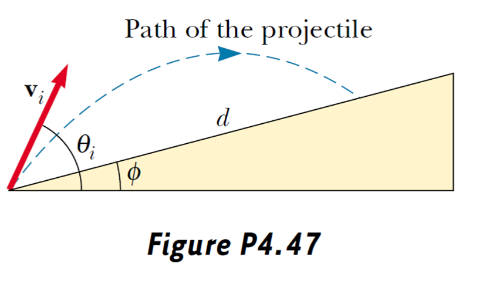
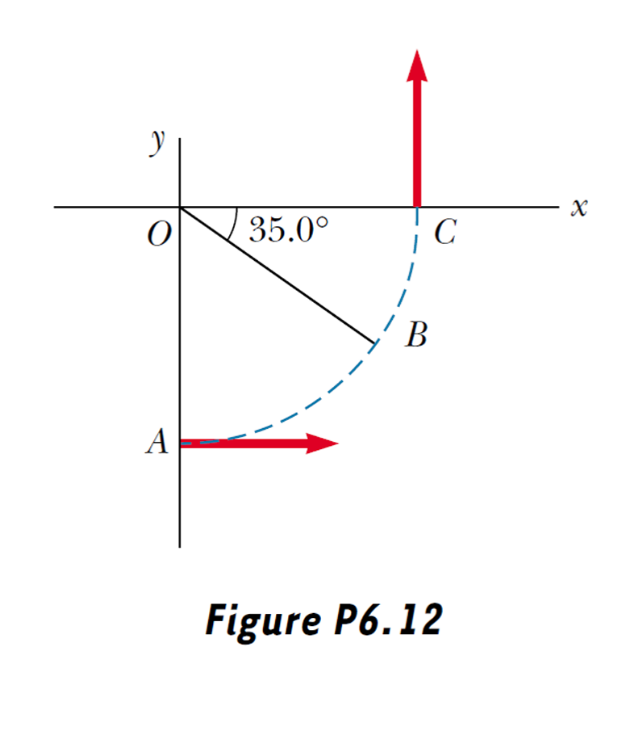

# Problem Set 1

> **1.** The displacement of a particle moving under uniform acceleration is some function of the elapsed time and the acceleration. Suppose we write this displacement $s = ka^{m}t^{n}$ , where $k$ is a dimensionless constant. Show by dimensional analysis that this expression is satisfied if $m = 1$ and $n = 2$ . Can this analysis give the value of $k$ ?

When $m=1,n=2$，then $L=[s]=[ka^mt^n]=[a]^m[t]^n=(L/T^2)\cdot T^2=L$.

So the expression is satisfied.

But dimension analysis can never give the value of $k$, because $k$ is a dimensionless constant.

> **2.** The radius of a solid sphere is measured to be $(6.50 \pm 0.20)$ cm, and its mass is measured to be $(1.85 \pm 0.02)$ kg. Determine the density of the sphere in kilograms per cubic meter and the uncertainty in the density.

Give $r=(6.50\pm0.20),m=(1.85\pm0.02)kg$。

Then density $\rho=\dfrac mV=\dfrac m{\frac43\pi r^3}=1.61\times 10^3kg/m^3$

$\dfrac{\Delta\rho}{\rho}=\dfrac1\rho\cdot\sqrt{(\dfrac{\partial\rho}{\partial m}\Delta m)^2+(\dfrac{\partial\rho}{\partial r}\Delta r)^2}=\dfrac{3\pi r^3}{4m}\cdot\sqrt{(\dfrac4{3\pi r^3}\Delta m)^2+(-\dfrac{4m}{\pi r^4}\Delta r)^2}=\sqrt{(\dfrac{\Delta m}{m})^2+(\dfrac{3\Delta r}{r})^2}$

So uncertainty $\Delta\rho=\rho\cdot\sqrt{(\dfrac{\Delta m}m)^2+(\dfrac{3\Delta r}r)^2}=0.15\times10^3kg/m^3$

So $\rho=(1.61\pm0.15)\times10^3kg/m^3$

> **3.** A particle moves along the $x$ axis. Its position is given by the equation $x = 2.00 + 3.00t - 4.00t^{2}$ with $x$ in meters and $t$ in seconds. Determine (a) its position at the instant it changes direction and (b) its velocity when it returns to the position it had at $t = 0$ .

$(a)$

$v=\dfrac{dx}{dt}=3-8t$

Solve the equation $v=0$, we know that at $t_0=\frac38s$, the point changes its direction, its position $x_0=2+3t_0-4t_0^2=\frac{41}{16}m$

$(b)$

The particle stats at $x_s=2m$。

Solve the equation $x=x_s$, we can get $t_1=\frac34s$, its current velocity $v_1=3-8t_1=-3m/s$

> **4.** Automotive engineers refer to the time rate of change of acceleration as the "jerk." If an object moves in one dimension such that its jerk $J$ is constant, (a) determine expressions for its acceleration $a_{x}$ , velocity $v_{x}$ , and position $x$ , given that its initial acceleration, speed, and position are $a_{x i}$ , $v_{x i}$ , and $x_{i}$ , respectively. (b) Show that $a_{x}^{2} = a_{x i}^{2} + 2J(v_{x} - v_{x i})$ .

$(a)$

$a_x-a_{xi}=\int_0^t J\cdot dt=tJ$, so $a_x=a_{xi}+tJ$

$v_x-v_{xi}=\int_0^t a_x\cdot dt=\int_0^t(a_{xi}+tJ)dt=a_{xi}t+\frac12Jt^2$, so $v_x=v_{xi}+a_{xi}t+\frac12Jt^2$

$x-x_i=\int_0^tv_x\cdot dt=\int_0^t(v_{xi}+a_{xi}t+\frac12Jt^2)dt=v_{xi}t+\frac12a_{xi}t^2+\frac16Jt^3$

So $x=x_i+v_{xi}t+\frac12a_{xi}t^2+\frac16Jt^3$

$(b)$

$a_x^2=(a_{xi}+tJ)^2=a_{xi}^2+2a_{xi}tJ+t^2J^2=a_{xi}^2+2J(a_{xi}t+\frac12Jt^2)=a_{xi}^2+2J(v_x-v_{xi})$

> **5.** A projectile is fired up an incline (incline angle $\phi$ ) with an initial speed $v_{i}$ at an angle $\theta_{i}$ with respect to the horizontal ( $\theta_{i} > \phi$ ), as shown in Figure P4.47. (a) Show that the projectile travels a distance $d$ up the incline, where
> 
> $$d = \frac{2v_{i}^{2}\cos\theta_{i}\sin(\theta_{i} - \phi)}{g\cos^{2}\phi}$$
> 
> (b) For what value of $\theta_{i}$ is $d$ a maximum, and what is that maximum value of $d$ ?

$(a)$

Assume the particle starts at point S, and hits the ground at point T, with the time duration $t$.

$\overrightarrow{r_T}=\overrightarrow{v_i}t+\frac12\overrightarrow{g}t^2$

Let's call the slope's direction vector $\vec{s}=\begin{pmatrix}\cos\phi\\\sin\phi\end{pmatrix}$

So $d\cdot\vec{s}=\vec{r_T}$, which yields $\begin{cases}\vec{v_i}\cos\theta_i t=d\cos\phi\\ \vec{v_i}\sin\theta_it-\frac12gt^2=d\sin\phi\end{cases}$

Solve it, we can get $d=\dfrac{2v_i^2\cos\theta_i\sin(\theta_i-\phi)}{g\cos^2\phi}$

$(b)$

$\dfrac{\partial d}{\partial\theta_i}=\dfrac{2v_i^2}{g\cos^2\phi}\cos(2\theta_i-\phi)$

Solve $\dfrac{\partial d}{\partial\theta_i}=0$, we can get $\theta_i=\dfrac\pi4+\dfrac{\phi}2$, and $d_{max}=\dfrac{(1-\sin\phi)v_i^2}{g\cos^2\phi}$

> **6.** A car initially traveling eastward turns north by traveling in a circular path at uniform speed as in Figure P6.12. The length of the arc ABC is 235 m, and the car completes the turn in 36.0 s. (a) What is the acceleration when the car is at B located at an angle of $35.0^{\circ}$ ? Express your answer in terms of the unit vectors $\mathbf{i}$ and $\mathbf{j}$ . Determine (b) the car's average speed and (c) its average acceleration during the 36.0- s interval.

$(a)$

Let's suppose the radius be $r$, and the distance that the car covers be $s$.

$\dfrac\pi2r=s$

$v=\dfrac{s}{t}$

$a=\dfrac{v^2}{r}$

And $\vec{a}=-a\cos\theta\bold{i}+a\sin\theta\bold{j}=(-0.233\bold{i}+0.163\bold{j})m/s^2$

$(b)$

$v=\dfrac{s}{t}=6.53m/s$

$(c)$

$\vec{a_{avg}}=\dfrac{\Delta v}{t}=\dfrac{v\bold{j}-v\bold{i}}{t}=(-0.181\bold{i}+0.181\bold{j})m/s^2$