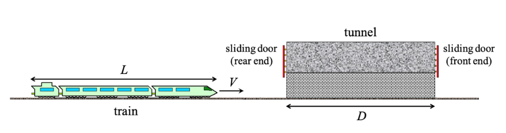

# Problem set #10

## 1

1. In 1962, when Mercury astronaut Scott Carpenter orbited the Earth 22 times, the press stated that for each orbit he aged 2 millionths of a second less than he would have had he remained on Earth. (a) Assuming that he was 160 km above the Earth in a circular orbit, determine the time difference between someone on Earth and the orbiting astronaut for the 22 orbits. (b) Did the press report accurate information? Explain.

(a)

$R_E=6371km,h=160km,R=R_E+h=6.531\times10^6m$.

Period of the orbit $T=2\pi\sqrt{\dfrac{R^3}{GM_E}}=5250s$

The velocity of the astronaut $v=\dfrac{2\pi R}{T}=7810m/s$

$\gamma=\dfrac{1}{\sqrt{1-(v/c)^2}}=1+3.38\times10^{-10}$

So $\Delta t=22T(1-\dfrac1\gamma)\approx39\mu s$

(b)

$\Delta t'=\dfrac{\Delta t}{22}\approx1.77\mu s\approx 2\mu s$

Approximately correct.

## 2

2. A rod of length $L_{0}$ moving with a speed $v$ along the horizontal direction makes an angle $\theta_{0}$ with respect to the $x^{\prime}$ axis. (a) Show that the length of the rod as measured by a stationary observer is

$$L = L_{0}\big[1 - (v /c)^{2}\cos^{2}\theta_{0}\big]^{1 / 2}$$

(b) Show that the angle that the rod makes with the $x$ axis is given by

$$\tan \theta = \gamma \tan \theta_{0}.$$

These results show that the rod is both contracted and rotated. (Take the lower end of the rod to be at the origin of the primed coordinate system.)

(a)

In frame $K$ where the rod is static, $x_0=L_0\cos\theta_0,y_0=L_0\sin\theta_0$.

In frame $K'$ where the Earth is static, $x=\sqrt{1-(v/c)^2}x_0,y=y_0$, so $L=\sqrt{x^2+y^2}=L_0\sqrt{1-(v/c)^2\cos^2\theta_0}$

(b)

$\tan\theta=\dfrac{y}{x}=\dfrac1{\sqrt{1-(v/c)^2}}\dfrac{y_0}{x_0}=\gamma\tan\theta_0$

## 3

3. A square with side $L$ flies past you at a speed $v$ , in a direction parallel to two of its sides. You stand in the plane of the square. When you see the square at its nearest point to you, show that it looks to you like it is rotated, instead of contracted. (Assume that $L$ is small compared with the distance between you and the square.)

We call the four edges of the square the left/right, far/near edge.

The length of the far/near edge: $L'=\dfrac L\gamma$

To make the light of the far/near edge reaches our eyes simultaneously, there exists a time difference $\Delta t\approx\dfrac Lc$.

During this period, the square moves $\Delta x=v\Delta t=\dfrac{vL}{c}$, so in our sight, the far edge is to the left of the near edge by $\Delta x$.

So the left/right edge looks like $\Delta x$.

If a square rotates by angle $\theta$, its edges will look like $L\cos\theta,L\sin\theta$, respectively.

Our edges look like $\dfrac{L}{\gamma}=\sqrt{1-(v/c)^2}L,\dfrac vcL$, if we take $\cos\theta=\sqrt{1-(v/c)^2},\sin\theta=\dfrac vc$, it looks like a rotated square.

## 4

4. Two planets, A and B, are at rest with respect to each other, a distance $L$ apart, with synchronized clocks. A space ship flies at speed $v$ past planet A toward planet B and synchronizes its clock with A's right with it passes A (assume their clocks both read zero). The spaceship eventually flies past planet B and compares its clock with B's. We know that, from working in the planets' frame, when the spaceship reaches B, B's clock reads $L / v$ . And the spaceship's clock reads $L / (\gamma v)$ , because it runs slow by a factor of $1/\gamma$ when viewed in the planets' frame. How would someone on the spaceship quantitatively explain to you why B's clock reads $L / v$ (which is more than its own $L/(\gamma v)$ ), considering that the spaceship sees B's clock running slow?

In $K$ frame where the planets are static, define 3 events: $E_1,E_2$ the clocks are synchronized at planets $A,B$, $E_3$ the ship arrives at $B$.

Represent their coordinates by $(ct,x)$. 

$E_1(0,0),E_2(0,L),E_3(\dfrac L\beta,L)$

In $K'$ frame where the ship is static.

$E_1(0,0),E_2(-\beta\gamma L,\gamma L),E_3(\gamma L(\dfrac1\beta-\beta),0)$

Consider $E_4$ is what clock $B$ looks like when clock $A$ is $0$ in frame $K'$.

$E_4(\dfrac L\gamma,0)$.

In frame $K$, $E_4(\dfrac{vL}{c},L)$

So from the view of the ship, when it goes off, the clock at $B$ shows $\dfrac{vL}{c^2}$.

The planet $B$ moves toward the ship at speed $v$, but this distance is $\dfrac L\gamma$, so it takes $\dfrac{L}{\gamma v}$ in the planet's frame.

But for the clock at $B$, it moves slower, it moves only $\dfrac{L}{\gamma^2 v}$.

So the clock at $B$ reads $\dfrac{vL}{c^2}+\dfrac{L}{\gamma^2 v}=\dfrac{L}{v}$

## 5

5. A train with proper length $L$ moves at speed $c / 2$ with respect to the ground. A ball is thrown from the back to the front, at speed $c / 3$ with respect to the train. How much time does this take, and what distance does the ball cover, in:

(a) The train frame?

(b) The ground frame? Solve this by i. Using a velocity-addition argument. ii. Using the Lorentz transformations to go from the train frame to the ground frame.

(c) The ball frame?

(d) Verify that the invariant interval is indeed the same in all three frames.

(e) Shown that the times in the ball frame and ground frame are related by the relevant $\gamma$ factor (or Lorentz factor).

(f) Ditto for the ball frame and the train frame.

(g) Show that the times in the train frame and ground frame are not related by the relevant $\gamma$ factor. Why not?

(a)

$t=\dfrac{L}{c/3}=\dfrac{3L}{c}$

$s=L$

(b)

i.

$v'=\dfrac{u+v}{1+\frac uc\frac vc}=\dfrac57c$

$L'=\dfrac L\gamma$

$t'=\dfrac{L'}{v'-u}=\dfrac{7\sqrt3 L}{3c}$

$s'=v't'=\dfrac{5\sqrt3 L}{3}$

ii.

In train frame, event $E_1$ the ball leaves, event $E_2$ the ball arrives.

$E_1(0,0),E_2(3L,L)$

By Lorentz transformation, in ground frame

$E_1(0,0),E_2(\dfrac{7\sqrt3}{3}L,\dfrac{5\sqrt3}{3}L)$

$t'=\dfrac{7\sqrt3 L}{3c},s'=\dfrac{5\sqrt3}{3}L$

(c)

In ball frame, $L''=\dfrac L{\gamma'}=\dfrac{2\sqrt2}{3}L$

$t''=\dfrac{L''}{c/3}=\dfrac{2\sqrt2L}{c}$

$s''=0$

(d)

$s^2=(c\Delta t)^2-(\Delta x)^2$

In train frame, $s^2=(c\cdot\dfrac{3L}{c})^2-(L)^2=8L^2$

In ground frame, $s^2=(c\cdot\dfrac{7\sqrt3 L}{3c})^2-(\dfrac{5\sqrt3 L}{3})^2=8L^2$

In ball frame, $s^2=(c\cdot\dfrac{2\sqrt2L}{c})^2-(0)^2=8L^2$

(e)

$\gamma_{bg}=\dfrac1{\sqrt{1-(5/7)^2}}=\dfrac{7\sqrt6}{12}$

So $\gamma_{bg}t''=t'$

(f)

$\gamma_{bt}=\dfrac{1}{\sqrt{1-(1/3)^2}}=\dfrac{3\sqrt2}{4}$

So $\gamma_{bt}t''=t$

(g)

$\gamma_{tg}=\dfrac{1}{\sqrt{1-(1/2)^2}}=\dfrac{2\sqrt3}{3}$

But $\gamma_{tg}t\neq t'$

Because the formula $\Delta t'=\gamma\Delta t$ holds only when $\Delta t$ is measured in a frame where the events happen at the same place.

## 6

6. Consider a train running at a constant speed $V$ on the straight track in the $x$ direction, and passing through a tunnel (see the figure). The length of the train measured in the train's rest frame (i.e., train frame) is $L$ , and the length of the tunnel measured in the tunnel's (and the track's) rest frame (i.e., track frame) is $D$ . Here we assume $L > D$ . Define $(ct, x)$ as the time and the space coordinates of the track frame, and $(ct', x')$ as those of the train frame. Here, $x$ and $x'$ are in the same direction.

(a) Suppose that an observer standing on the ground sees that the train is shorter than the tunnel, so that the whole train can be inside the tunnel. Determine the smallest possible speed of the train.
(b) Suppose that the rear end of the tunnel (see the figure) is at $x = 0$ , and set the time $t = t' = 0$ when the rear end of the train reaches the rear end of the tunnel. Draw the Minkowski diagram taking $x$ coordinate for the horizontal axis and $ct$ coordinate for the vertical axis. In addition, specify $L$ and $D$ in the diagram.
(c) When the rear end of the train enters the rear end of the tunnel, the rear-end and front-end sliding doors of the tunnel (see the figure) are closed at the same time in the track frame. These two events are denoted by $R_{\mathrm{close}}$ and $F_{\mathrm{close}}$ , respectively. Then, when the front-end of the train reaches the front-end of the tunnel, both the rear-end and front-end sliding doors are opened at the same time in the track frame. These events are denoted by $R_{\mathrm{open}}$ and $F_{\mathrm{open}}$ , respectively.
Show the events $R_{\mathrm{close}}$ , $F_{\mathrm{close}}$ , $R_{\mathrm{open}}$ , and $F_{\mathrm{open}}$ in the Minkowski diagram in (b), and put the four events in the order of being seen by an observer in the train.
(d) Finally, consider a modified case in which the train suddenly (i.e., instantaneously in the train frame) stops when the front end of the train reaches the front-end sliding door of the tunnel. Determine the time $t = t_f$ in the track frame at which the front end of the train stops, and plot the length of the train in the track frame as a function of $t$ .

(a)

$L'=\dfrac{L}{\gamma}$.

Let $L'=D$, so $v_{min}=\sqrt{1-(D/L)^2}c$

(b)

Ignored.

(c)

Ignored.

In track frame,

$R_{close}=(0,0),F_{close}=(0,D),F_{open}=(c\dfrac{D-L/\gamma}{v},D),R_{open}=(c\dfrac{D-L/\gamma}{v},0)$

In train frame,

$R_{close}=(0,0),F_{close}=(-\beta\gamma D,\gamma D),F_{open}=(\dfrac cv(\dfrac D\gamma-L),L),R_{open}=(\dfrac cv(D\gamma-L),*)$

$F_{close},F_{open},R_{close},R_{open}$

(d)

Event $F_{stop}=F_{open}=(\dfrac cv(\dfrac D\gamma-L),L),R_{stop}=(\dfrac cv(\dfrac D\gamma-L),0)$.

So back to track frame, $F_{stop}=(\dfrac cv(D-\dfrac L\gamma),D),R_{stop}=(\dfrac cv(D-L\gamma),D-L\gamma)$.

So when it stops, the length is $D-(D-L\gamma)=\gamma L$

$$
L(t)=\begin{cases}
\dfrac{L}{\gamma},&t\le\dfrac{D-\gamma L}{v}\\
vt+\dfrac L\gamma+\gamma L-D,&\dfrac{D-\gamma L}{v}<t<\dfrac{D-L/\gamma}{v}\\
\gamma L,&t\ge\dfrac{D-L/\gamma}{v}\\
\end{cases}
$$