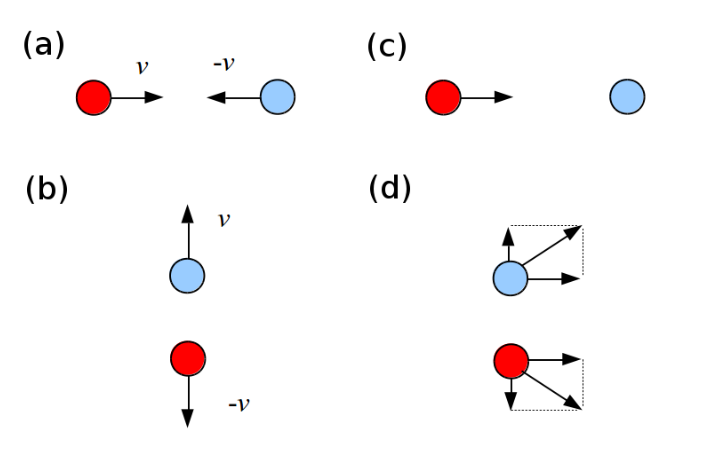
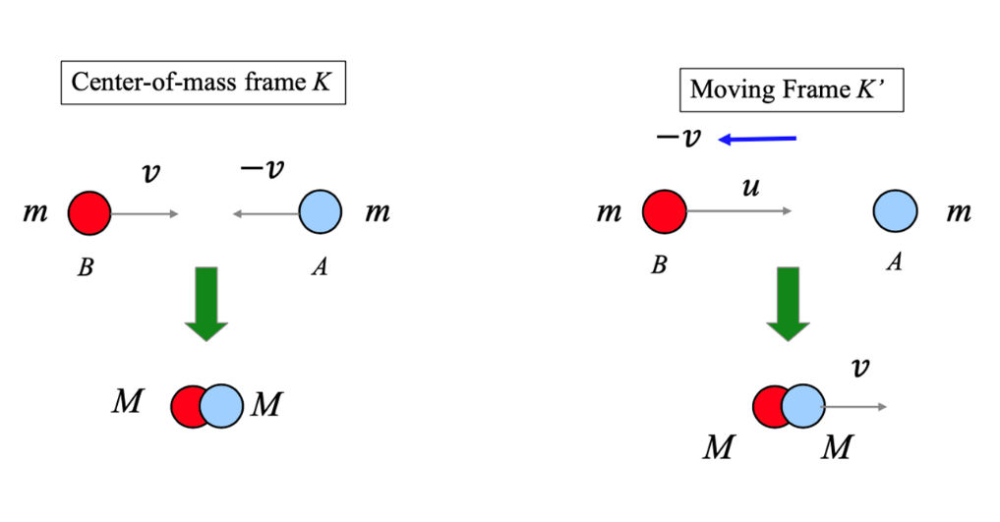

# Problem set #11

## 1. 
Calculate the momentum of an electron moving with a speed of (a) $0.0100c$, (b) $0.500c$, (c) $0.900c$. For what speed does the use of the nonrelativistic expression for the momentum of a particle yield an error in the momentum of 1.00 percent?

Suppose the mass of the electron be $m_e\approx9.11\times10^{-31}kg$

$p=\dfrac{m_e}{\sqrt{1-(v/c)^2}}v$

(a) $p_1\approx1.00005\times10^{-2}m_ec\approx2.73\times10^{-24}kg\cdot m/s$

(b) $p_2\approx0.57735m_ec\approx1.58\times10^{-22}kg\cdot m/s$

(c) $p_3\approx2.0646m_ec\approx5.64\times10^{-22}kg\cdot m/s$

Nonrelativistic scenario: $p'=m_ev$

Let $\dfrac{p-p'}{p}=0.01$, we get $\gamma=\dfrac1{0.99},v\approx0.141c$

## 2.
Electrons are accelerated to an energy of $20.0\mathrm{GeV}$ in the 3.00-km-long Stanford Linear Accelerator. (a) What is the $\gamma$ factor for the electrons? (b) What is their speed? (c) How long does the accelerator appear to them?

(a)

$\gamma=\dfrac{E}{m_ec^2}\approx3.91\times10^4$

(b)

$\dfrac1{\sqrt{1-(v/c)^2}}=\gamma$, so $v\approx(1-3.27\times10^{-10})c$

(c)

$L=\dfrac{L_0}{\gamma}\approx7.67\times10^{-2}m$

## 3.
When $1.00\mathrm{g}$ of hydrogen combines with $8.00\mathrm{g}$ of oxygen, $9.00\mathrm{g}$ of water is formed. During this chemical reaction, $2.86\times 10^{5}\mathrm{J}$ of energy is released. How much mass do the constituents of this reaction lose? Is the loss of mass likely to be detectable?

$\Delta E=\Delta mc^2$, so $\Delta m\approx3.18\times10^{-12}kg$

The ratio $\dfrac{\Delta m}{m}\approx 3.53\times10^{-10}$, it's impossible to detect.

## 4.
In a nuclear power plant the fuel rods last 3 yr before they are replaced. If a plant with rated thermal power $1.00\mathrm{GW}$ operates at $80.0\%$ capacity for the 3 yr, what is the loss of mass of the fuel?

$P_{real}=\alpha P_0=8\times10^8W$

$t=3\times365\times24\times3600\approx9.46\times10^7s$

$\Delta E=P_{real}t\approx7.568\times10^{16}J$

$\Delta m=\dfrac{\Delta E}{c^2}\approx0.841kg$

## 5.
In class, we showed that the classical definition of the linear momentum cannot be right in the relativistic case. We illustrated by the example of the collision of two particles with equal mass. In the rest frame (for the center of mass) $K$, the two particles have velocities with the same amplitude $v$ but opposite directions along $x$ axis before the collision, as illustrated in Fig. (a). After the collision, they move away along $y$ axis with the same speed $v$, as illustrated in Fig. (b). Now, in a frame $K'$ that moves with speed $v$ along the negative $x$ direction with respect to the rest frame $K$ [Fig. (c)], one particle is at rest before the collision. (i) What is the velocity of the other particle before the collision? (ii) After the collision [Fig. (d)], what are the velocities of the two particles? Specify the components of the velocities along $x$ and $y$ axes. (iii) Show that if you use the definition of the relativistic momentum, you will maintain the conservation of linear momentum in the moving frame $K'$.

(i)

$u=\dfrac{v+v}{1+\frac vc\frac vc}=\dfrac{2v}{1+(v/c)^2}$

(ii)

Call the left ball ball 1, the right one ball 2.

By Lorentz tranformation from (b) to (d), $v_{1x}'=v_{2x}'=v$, $-v_{1y}'=v_{2y}'=\dfrac{v}\gamma$

(iii)

$p_{2x}=p_{2y}=0$, $p_{1y}=0,p_{1x}=\dfrac{m}{\sqrt{1-(u/c)^2}}u=2\gamma^2mv$

$v'=\sqrt{v_{1x}'^2+v_{2x}'^2}=\sqrt{2-(v/c)^2}v$

$p_{1x}'=p_{2x}'=\dfrac{m}{\sqrt{1-(v'/c)^2}}v=\gamma^2mv$

$p_{1y}'=-\dfrac{m}{\sqrt{1-(v'/c)^2}}\dfrac{v}\gamma=-\gamma mv$

$p_{2y}'=-p_{1y}'=\gamma mv$

So $p_{1x}+p_{2x}=p_{1x}'+p_{2x}',p_{1y}+p_{2y}=p_{1y}'+p_{2y}'$

## 6.
Perfectly Inelastic Collision of two Relativistic Particles

Consider a perfectly inelastic collision of two relativistic particles (particles $A$ and $B$) with equal rest mass $m$. In the center-of-mass frame $K$, the two particles have velocities with the same magnitude $v$, but opposite directions along $x$ axis before the collision, as illustrated in the top left part of the figure. After the collision, they stick together, as illustrated in the bottom left part of the figure. Now, in another frame $K'$ that moves with speed $v$ along the negative $x$ direction with respect to the $K$-frame (right part of the figure), particle $A$ is at rest before the collision.

(a) Considering the energy conservation for the collision in $K$-frame, calculate the rest mass $M$ of each particle after the collision.

(b) In $K'$-frame, what is the velocity of particle $B$ before the collision?

(c) In $K'$-frame, show the linear momentum and energy are conserved in the collision process.

(a)

$$
2\gamma mc^2=2Mc^2
$$

So $M=\gamma m=\dfrac{m}{\sqrt{1-(v/c)^2}}$

(b)

$u=\dfrac{v+v}{1+\frac vc\frac vc}=\dfrac{2v}{1+(v/c)^2}$

(c)

Distinguish the two balls with their color (r/b).

Before the collision:

$p_{rx}=\gamma_{r}mu=2\gamma^2mv$

$E=\gamma_rmc^2+mc^2=2\gamma^2mc^2$

After the collision:

$p_{rx}'=p_{bx}'=\gamma Mv=\gamma^2mv$

$E'=2\gamma Mc^2=2\gamma^2mc^2$

So $p_{rx}=p_{rx}'+p_{bx}',E=E'$

## 7.
Relativistic Scattering between a Photon and an Electron

In this problem, a particular scattering process between a photon and an electron known as Compton scattering will be addressed. For simplicity, we will consider only one spatial dimension so that spatial vectors $\vec{a} = a\vec{e}_{x}$ possess only one non-zero component and where $\vec{e}_{x}$ is the unit vector along the $x$ axis. In this setting, a photon of energy $E_{\mathrm{ph}}$ is propagating along the $x$ axis and hits an electron. We want to understand with which energy the photon is scattered back along the $x$ axis in terms of the initial parameters. ($c$: speed of light)

(a) As a first step, write down

(i) the relativistic expressions for the energy $E$ and momentum $\vec{p}$ of a particle of mass $m$.

(ii) the expressions for $E^{\prime} / c$ and $\vec{p}^{\prime}$ in terms of $E / c$ and $\vec{p}$ in an inertial frame that moves with velocity $\vec{u} = u\vec{e}_{x}$ relative to the one where the particle has energy $E / c$ and momentum $\vec{p}$.

[Hint, the Lorentz transformation of the position four-vector is $(ct^{\prime},x^{\prime},0,0) = (\gamma ct - \beta \gamma x,\gamma x - \beta \gamma ct,0,0)$, $\beta = u / c$, $\gamma = 1 / \sqrt{1 - \beta^{2}}$.]

(b) Consider the energy-momentum four-vector $\mathbf{P}$ defined as $\mathbf{P} = (E / c,\vec{p})$.

(i) Show that $\mathbf{P}.\mathbf{P}$ yields the energy-momentum relation, where $\mathbf{P}.\mathbf{P}$ denotes the scalar product of four-vector $\mathbf{P}$ with itself. [Hint: For four-vectors $\mathbf{A} = (a_{0},\vec{a})$ and $B = (b_{0},\vec{b})$, the scalar product is defined as $\mathbf{A}.\mathbf{B} = a_{0}b_{0} - \vec{a}\cdot \vec{b}$]

(ii) Show that $\mathbf{P}^{\prime}.\mathbf{P}^{\prime} = \mathbf{P}.\mathbf{P}$ where $\mathbf{P}^{\prime} = (E^{\prime} / c,\vec{p}^{\prime})$.

(iii) The energy-momentum relation for a photon is that of a particle of vanishing rest mass. If $\mathbf{K}=(E_{ph}/c,\vec k)$ is the energy-momentum four-vector of a photon, what is the value of $\mathbf{K}.\mathbf{K}$?

3) The energy-momentum relation for a photon is that of a particle of vanishing rest mass. If $\mathbf{K} = (E_{\mathrm{ph}} / c,\vec{k})$ is the energy-momentum four-vector of a photon, what is the value of $\mathbf{K}.\mathbf{K}$?

(c) Consider now a photon of 4-momentum $\mathbf{K}$ that is propagating along the $x$ axis and hits an electron with mass $m$ and 4-momentum $\mathbf{P}$ and is scattered back elastically along the $x$ axis with energy $E_{\mathrm{ph}}^{\mathrm{fl}}$. What is $E_{\mathrm{ph}}^{\mathrm{fl}}$ in terms of $m$ and $E_{\mathrm{ph}}$? The result is commonly quoted in terms of $1 / E_{\mathrm{ph}}^{\mathrm{fl}}$.

(Hint: One way to proceed is to choose the rest frame of the electron before the collision, write down the energy-momentum four-vectors before and after the collision and relate the four-vectors before and after the collision using energy and momentum conservation.)

(a)

(i)

$E=\gamma mc^2,\vec p=\gamma m\vec v$

(ii)

$v'=\dfrac{v-u}{1-\frac uc\frac vc}$

$\gamma'=\dfrac{1}{\sqrt{1-(v'/c)^2}}=\dfrac{1-\beta_u\beta_v}{\sqrt{1-\beta_u^2}\sqrt{1-\beta_v^2}}$

$\dfrac{E'}{c}=\gamma'mc=\gamma_u(\dfrac Ec-\beta_u p)$

$\vec p'=\gamma'm\vec v'=\gamma_u(p-\beta_u\dfrac Ec)$

(b)

(i)

$P\cdot P=(\dfrac{E}{c})^2-p^2=m^2c^2$ is a constant.

(ii)

$P\cdot P=m^2c^2=P'\cdot P'$

(iii)

$K\cdot K=\dfrac{E_{ph}}{c}^2-k^2=m_{ph}^2c^2=0$.

(c)

In a frame where the electron is initially stationary:

$\vec K=(E_k/c,E_k/c),\vec P=(m_ec,0)$

$\vec P_{tot}=\vec K+\vec P=(E_k/c+m_ec,E_k/c)$

Suppose after collision, the two 4-momentum are $\vec K'=(E_k'/c,-E_k'/c),\vec P'=(E_p'/c,\vec p')$.

So $\vec K'+\vec P'=\vec P_{tot}$, $\vec P'=\vec P_{tot}-\vec K'$

So $\vec P'^2=\vec P_{tot}^2+\vec K'^2-2\vec K'\vec P_{tot}$

So $m_e^2c^2=m_e^2c^2+2E_km_e+0-2(m_eE_k'+\dfrac{2E_kE_k'}{c^2})$

So $\dfrac1{E_{ph}^{fi}}=\dfrac1{E_k'}=\dfrac1{E_{ph}}+\dfrac2{mc^2}$.