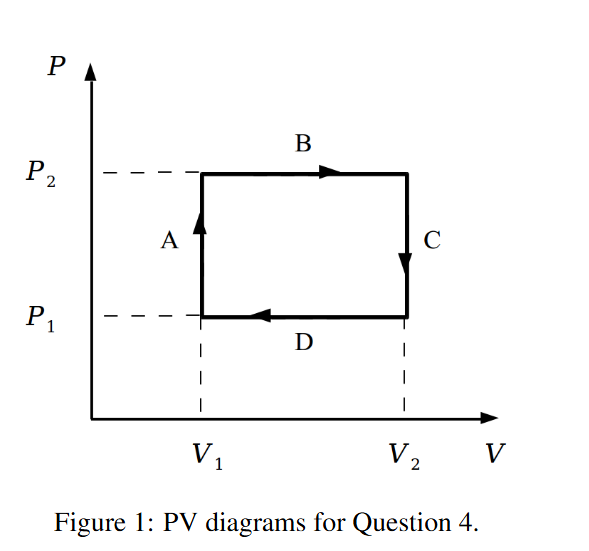
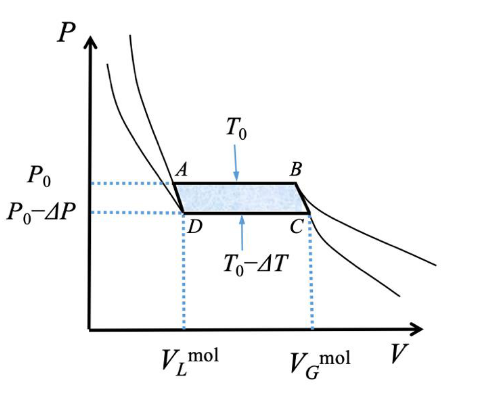

# Problem set #13

## 1. 
If we apply the highly successful kinetic theory of gases to a metal, considered as a gas of electrons (in fact, back in 1900 Drude constructed the theory, hence the Drude theory of metals), and assume that the electron velocity distribution is given by the Maxwell distribution, what would the most probable speed, average speed, and rms speed for electrons at room temperature? Compare to those of the $\mathrm{H}_{2}$ gas.

$T=300K,m_e=9.11\times10^{-31}kg,k_B=1.38\times10^{-23}J/K$

$v_p=\sqrt{\dfrac{2k_BT}{m}}\approx9.53\times10^4m/s$

$\bar v=\sqrt{\dfrac{8k_BT}{\pi m}}\approx1.08\times10^5m/s$

$v_{rms}=\sqrt{\dfrac{3k_BT}{m}}\approx1.65\times10^5m/s$

Compared with H2, they only differ in mass, and $\dfrac{m_{H_2}}{m_e}\approx0.36\times10^4$, so the ratio $\dfrac{v_{e}}{v_{H_2}}=\sqrt{\dfrac{m_{H_2}}{m_e}}\approx 60$

## 2.
How much heat is needed to convert $1\mathrm{kg}$ of ice at $-10^{\circ}\mathrm{C}$ to steam at $100^{\circ}\mathrm{C}$? Look up the necessary constants from books or the Internet yourself.

$c_{ice}=2100J/(kg\cdot K),c_{water}=4186J/(kg\cdot K)$

$L_f=3.34\times10^5J/kg,L_v=2.26\times10^6J/kg$

$\Delta T_1=10K,Q_1=mc_{ice}\Delta T_1=2.10\times10^4J$

$Q_2=mL_f=3.34\times10^5J$

$\Delta T_2=100K,Q_3=mc_{water}\Delta T_2=4.186\times10^5J$

$Q_4=mL_v=2.26\times10^6J$

$Q=Q_1+Q_2+Q_3+Q_4=3.0336\times10^6J$

## 3.
An iron rod (with heat conductivity being $80\mathrm{W / m}\cdot \mathrm{K}$) of length $1\mathrm{m}$ and radius $2\mathrm{cm}$ has one end dipped into an ice-water mixture and the other in boiling water. What is the heat flow $Q / \Delta t$?

$j_q=-\kappa_{iron}\dfrac{\Delta T}{\delta x}=8000W/m^2$

$\dfrac{dQ}{dt}=j_QA\approx10.05W$

## 4.
An ideal diatomic gas, in a cylinder with a movable piston, undergoes the rectangular cyclic process shown in Figure 1. Assume that the temperature is always such that rotational degrees of freedom are active, but vibrational modes are "frozen out." Also assume that the only type of work done on the gas is quasistatic compression-expansion work.  
(i) For each of the four steps A through D, compute the work done on the gas, the heat added to the gas, and the change in the internal energy of the gas. Express all answers in terms of $P_{1}, P_{2}, V_{1}$, and $V_{2}$.  
(ii) Describe in words what is physically being done during the four steps; for example, during step A, heat is added to the gas (from an external source) while the piston is held fixed.  
(iii) Compute the net work done on the gas, the net heat added to the gas, and the net change in the internal energy of the gas during the entire cycle. Are the results as you expected? Explain briefly.

For a diatomic molecule, $t=3,r=2,s=1$, but vibrational modes are frozen, so $f=5$.

(i)

A: $W_A=0,\Delta U_A=\dfrac52V_1(P_2-P_1),Q_A=W_A+\Delta U_A=\dfrac52V_1(P_2-P_1)$

B: $W_B=P_2(V_2-V_1),\Delta U_B=\dfrac52P_2(V_2-V_1),Q_B=W_B+\Delta U_B=\dfrac72P_2(V_2-V_1)$

C: $W_C=0,\Delta U_C=\dfrac52V_2(P_1-P_2),Q_C=W_C+\Delta U_C=\dfrac52V_2(P_1-P_2)$

D: $W_D=P_1(V_1-V_2),\Delta U_D=\dfrac52P_1(V_1-V_2),Q_D=W_D+\Delta U_D=\dfrac72 P_1(V_1-V_2)$

(ii)

A: heat is added, pistol is fixed.

B: heat is added, pistol moves to keep pressure fixed.

C: head is removed, pistol is fixed.

D: heat is removed, pistol moves to keep pressure fixed.

(iii)

$W=(P_2-P_1)(V_2-V_1),\Delta U=0,Q=(P_2-P_1)(V_2-V_1)$

As expected, the internal energy stays unchanged ($T,p,V$ stays unchanged), but the gas do work to the external environment, so it has to absorb $Q$.

## 5.
In a Diesel engine, atmospheric air is quickly compressed to about $1/20$ of its original volume. Estimate the temperature of the air after compression, and explain why a Diesel engine does not require spark plug?

$\gamma=1.4,T_1=300K$

$T_2=T_1(\dfrac{V_1}{V_2})^{\gamma-1}\approx994K\approx720^\circ C$

Very high temperature, a spark plug is not needed.

## 6.
For a van der Waals gas, its equation of state implies a phase transition between liquid and gas below a critical temperature $T_{c}$: In the $P$-$V$ (pressure-volume) phase diagram, the isothermal line for a given temperature $T_{0} < T_{c}$ is not monotonically decreasing with respect to $V$, but a constant function of $V$ in some region (see the figure). This region corresponds to a phase transition from liquid to gas state (with a volume change from $V_{L}^{\mathrm{mol}}$ to $V_{G}^{\mathrm{mol}}$), and the mole latent heat is $L$ for the transition. Suppose we use 1 mole of this van der Waals gas/liquid mixture as the medium for a Carnot cycle operating between the high temperature $T_{0}$ and the low temperature $T_{0} - \Delta T$, which are connected by two adiabatic processes $D\rightarrow A$ and $B\rightarrow C$. The pressure in the flat region changes from $P_{0}$ to $P_{0} - \Delta P$ when the temperature changes from $T_{0}$ to $T_{0} - \Delta T$.

(a) Specify the heat transfer and work done in each process of $A\rightarrow B$, $B\rightarrow C$, $C\rightarrow D$, and $D\rightarrow A$ in such a Carnot cycle. Here, we assume that the volume change in $B\rightarrow C$ and $D\rightarrow A$ is negligible.

(b) Calculate the total work done to the environment for this Carnot cycle and express its efficiency $\epsilon$ from $\epsilon = W / Q_{H}$, where $W$ and $Q_{H}$ is the total work output in the cycle and the heat input at the high temperature, respectively.

(c) For a Carnot engine with efficiency $\epsilon = 1 - \frac{T_{C}}{T_{H}}$, verify the Clapeyron equation:

$$\frac{dP}{dT} = \frac{L}{T(V_{G}^{\mathrm{mol}} - V_{L}^{\mathrm{mol}})}$$

for the liquid/gas mixture.

(d) From the Clapeyron equation, explain why the boiling temperature $T_{1}$ of water decreases when the pressure is lower at a high mountain.

(1)

$A\to B$: work $W_{AB}=P_0(V_G-V_L)$, heat $Q_{AB}=nL$

$B\to C$: work $W_{BC}=0$, heat $Q_{BC}=0$

$C\to D$: work $W_{CD}=-(P_0-\Delta P)(V_G-V_L)$, heat $Q_{CD}=-nL$

$D\to A$: work $W_{DA}=0$, heat $Q_{DA}=0$

(b)

$W=W_{AB}+W_{BC}+W_{CD}+W_{DA}=\Delta P(V_G-V_L)$

$\epsilon=\dfrac{W}{Q_H}=\dfrac{\Delta P(V_G-V_L)}{nL}$

(c)

$1-\dfrac{T_C}{T_H}=\dfrac{\Delta P(V_G-V_L)}{nL}$

So $\dfrac{\Delta P}{\Delta T}=\dfrac{nL}{T(V_G-V_L)}$, where $n=1$.

Let $\Delta T\to 0$, so $\dfrac{dP}{dT}=\dfrac{L}{T(V_G-V_L)}$

(d)

For water, $L>0,V_G>V_L$, so $\dfrac{dP}{dT}>0$

So as pressure is lower, the temperature is also lower.