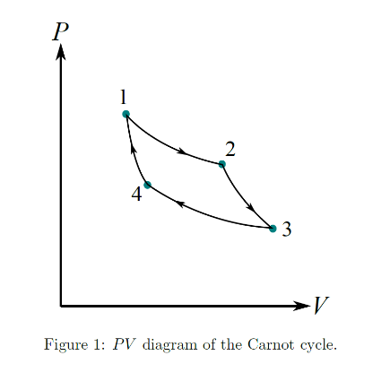

# Problem set #14

## 1. 
In order to take a nice warm bath, you mix 50 liters of hot water at $55^{\circ}\mathrm{C}$ with 25 liters of cold water at $10^{\circ}\mathrm{C}$. How much new entropy have you created by mixing the water?

$\dfrac{n_1}{n_2}=\dfrac{50L}{25L}=2,T_1=55^\circ C,T_2=10^\circ C$

Suppose after mixing, the water settles at $T$.

So $\Delta Q_1=n_1c_v(T-T_1),\Delta Q_2=n_2c_v(T-T_2),\Delta Q_1+\Delta Q_2=0$

$T=40^\circ C$

$\Delta s_1=n_1c_v\ln\dfrac{T}{T_1},\Delta s_2=n_2c_v\ln\dfrac{T}{T_2}$

$\Delta s=\Delta s_1+\Delta s_2=755J/K$

## 2.
Calculate the change in entropy for a process in which 2 moles of an ideal gas undergoes a free expansion to three times its initial volume.

$\Delta s=nR\ln\dfrac{V_f}{V_i}=18.27J/K$

## 3.
Experimental measurements of the heat capacity of aluminum at low temperatures (below about $50\mathrm{K}$) can be fit to the formula

$$C_{V} = aT + bT^{3},$$

where $C_{V}$ is the heat capacity of one mole of aluminum, and the constants $a$ and $b$ are approximately $a = 0.00135$ $\mathrm{J / K^2}$ and $b = 2.48\times 10^{- 5}\mathrm{J / K^4}$. From this data, find a formula for the entropy of a mole of aluminum as a function of temperature (assuming $S = 0$ at $0\mathrm{K}$). Evaluate your formula at $T = 1\mathrm{K}$ and at $T = 10\mathrm{K}$.

$$
\begin{aligned}
S(T)&=S(0)+\int_0^T\dfrac{dQ}{t}\\
&=\int_0^T(a+bt^2)dt\\
&=aT+\dfrac13bT^3\\
&=0.00135T+8.27\times10^{-6}T^3
\end{aligned}
$$

$S(1)=0.001358J/K,S(10)=0.02177J/K$

## 4.
Derive the efficiency of the Otto cycle

$$e = 1 - \left(\frac{V_2}{V_1}\right)^{\gamma - 1},$$

where $V_{1} / V_{2}$ is the compression ratio and $\gamma$ is the adiabatic exponent.

$Q_H=nc_v(T_C-T_B),Q_L=nc_v(T_D-T_a)$

AB: $T_AV_1^{\gamma-1}=T_BV_2^{\gamma-1}$, so $\dfrac{T_A}{T_B}=(\dfrac{V_2}{V_1})^{\gamma-1}$

CD: $T_CV_2^{\gamma-1}=T_DV_1^{\gamma-1}$, so $\dfrac{T_D}{T_C}=(\dfrac{V_2}{V_1})^{\gamma-1}$

$\epsilon=\dfrac{Q_H-Q_L}{Q_H}=1-\dfrac{T_D-T_A}{T_C-T_B}=1-(\dfrac{V_2}{V_1})^{\gamma-1}$

## 5.
A bit of computer memory is some physical object that can be in two different states, often interpreted as 0 and 1. A byte is eight bits, a kilobyte is $1024 = 2^{10}$ bytes, a megabyte is 1024 kilobytes, and a gigabyte is 1024 megabytes. (i) Suppose that your computer erases or overwrites one gigabyte of memory, keeping no record of the information that was stored. Explain why this process must create a certain amount of entropy, and calculate how much. (ii) If the entropy is dumped into an environment at room temperature, how much heat must come along with it? Is this amount of heat significant?

(i)

Before the operation, these 1 Gigabyte can be in only one condition, but after the operation, every bit has 2 possibilities, so entroy increases.

$\Delta s=k_B\ln2^{2^{30}}-K_B\ln1=2^{30}k_B\ln2=8.21\times10^{-14}J/K$

(ii)

$\dfrac{Q}{T}=\Delta s$, so $Q=T\Delta s$, suppose $T=300K$, then $Q=2.46\times10^{-11}J$, not significant.

## 6.
## Entropy and the Carnot cycle

Consider the Carnot cycle operating with a hot and cold heat baths whose temperatures are $T_{h}$ and $T_{c}$ $(T_{h} > T_{c})$, respectively. Working substance means the gas in the engine, and we consider a gas in general for the working substance.

(a) Suppose the amount of heat exchange during the isothermal process with the hot (cold) heat bath is $Q_{h}$ $(Q_{c})$, and determine the entropy change $\Delta S_{h}$ and $\Delta S_{c}$ of the working substance in the respective process. Then, specify $\Delta S_{h}$ and $\Delta S_{c}$ are positive or negative. Here, take the positive sign of $Q_{h}$ and $Q_{c}$ for the heat input from the heat bath to the working substance.

(b) Figure 1 shows the pressure-volume $(PV)$ diagram of the Carnot cycle. Draw a temperature-entropy $(TS)$ diagram of the corresponding Carnot cycle. Here, take the temperature $T$ for the vertical axis, and the entropy $S$ for the horizontal axis. Specify the direction and what kind of quasi-static process (i.e., isothermal/adiabatic/isobaric/isovolumetric; compression/expansion) it is for each stroke.

(c) Using the result of (a), derive the efficiency $\eta$ of the Carnot cycle in terms of $T_{h}$ and $T_{c}$. Here, the efficiency is defined as $\eta \equiv W / Q_{h}$, where $W$ is the total work output through the cycle.

(d) Now we use an ideal gas as the working substance and consider a free expansion process. Suppose the initial temperature of the gas is $T_{i}$ and the volume of the gas increases from $V_{i}$ to $V_{f}$. Determine the heat input $Q_{fe}$ and the entropy change $\Delta S_{fe}$ of the working substance through the free expansion process.

(e) By replacing a quasi-static isothermal expansion process in the Carnot cycle by a free expansion process, it seems that it is possible to construct a cycle with a single heat bath. Does this fact violate the second law of thermodynamics? Answer by yes or no, then explain your answer using the case of the Carnot cycle.

(a)

$\Delta S_h=\dfrac{Q_h}{T_h},\Delta S_c=\dfrac{Q_c}{T_c}$

(b)

Ignored.

(c)

$W=Q=\oint TdS=(T_h-T_c)(S_2-S_1)$

$Q_h=T_h(S_2-S_1)$

So $\iota=\dfrac{W}{Q_h}=1-\dfrac{T_c}{T_h}$

(d)

$Q_{fe}=0$

$\Delta S_{fe}=nR\ln\dfrac{V_f}{V_i}$

(e)

No.

A free expansion is not reversible, so the cycle must have some side effects.