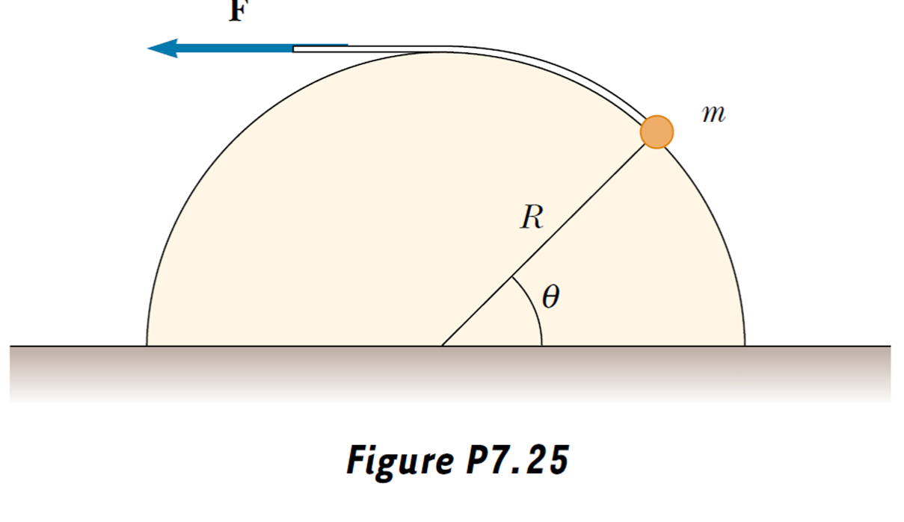

## Problem set #2

> 1. A $3.00$‑kg mass is moving in a plane, with its $x$ and $y$ coordinates given by $x = 5t^2 - 1$ and $y = 3t^3 + 2$, where $x$ and $y$ are in meters and $t$ is in seconds. Find the magnitude of the net force acting on this mass at $t = 2.00$ s.

$\vec r=x\hat x+y\hat y$

$\vec v=x'\hat x+y'\hat y$

$\vec a=x''\hat x+y''\hat y=10\hat x+18t\hat y$

At $t=2.00$ s, $\vec a=10\hat x+36\hat y, |\vec F|=m|\vec a|=112$ N

> 2. The coefficient of static friction is 0.800 between the soles of a sprinter's running shoes and the level track surface on which she is running. Determine the maximum acceleration she can achieve. Do you need to know that her mass is 60.0 kg?

Assume her mass is $m$.

Maximum static friction $|\vec f_s|=\mu_s F_n=\mu_smg$

Maximum acceleration $|\vec a|=\dfrac{|\vec f_s|}{m}=\mu_sg=7.84m/s^2$

So there's no need to know her mass.

> 3. Assume that the resistive force acting on a speed skater is $f = -kmv^2$, where $k$ is a constant and $m$ is the skater's mass. The skater crosses the finish line of a straight-line race with speed $v_f$ and then slows down by coasting on his skates. Show that the skater's speed at any time $t$ after crossing the finish line is $v(t) = v_f / (1 + ktv_f)$.

$$
ma=f=-kmv^2\\
\dfrac{dv}{dt}=-kv^2\\
\dfrac{dv}{v^2}=-kdt\\
-\dfrac1v=-kt+C
$$

when $t=0$, we know $v=v_f$, so we can obtain $C=-\dfrac1{v_f}$

Thus $v=\dfrac{v_f}{1+ktv_f}$

> 4. A small mass $m$ is pulled to the top of a frictionless half‑cylinder (of radius $R$) by a cord that passes over the top of the cylinder, as illustrated in Figure P7.25.  
>   $(a)$ If the mass moves at a constant speed, show that $F = mg \cos \theta$. (Hint: If the mass moves at a constant speed, the component of its acceleration tangent to the cylinder must be zero at all times.)  
>   $(b)$ By directly integrating $W = \int \mathbf{F} \cdot d\mathbf{s}$, find the work done in moving the mass at constant speed from the bottom to the top of the half‑cylinder. Here $d\mathbf{s}$ represents an incremental displacement of the small mass.

$(a)$

From the free-body diagram, we can know that

$$
\begin{cases}
F-mg\cos\theta=0\\
mg\sin\theta-F_N=m\dfrac{v^2}R
\end{cases}
$$

So $F=mg\cos\theta$

$(b)$

Consider a $d\theta$, we know $ds=Rd\theta$

So $W=\int_0^\frac{\pi}2 F\cdot ds=\int_0^\frac{\pi}2 mg\cos\theta\cdot Rd\theta=mgR$

> 5. An energy‑efficient lightbulb, taking in $28.0$ W of power, can produce the same level of brightness as a conventional bulb operating at $100$ W power. The lifetime of the energy‑efficient bulb is $10 000$ h and its purchase price is \$$17.0$, whereas the conventional bulb has a lifetime of $750$ h and costs \$$0.420$ per bulb. Determine the total savings obtained through the use of one energy‑efficient bulb over its lifetime as opposed to the use of conventional bulbs over the same time period. Assume an energy cost of \$$0.0800$ per kilowatt hour.

Through the lifetime of one energy-efficinet bulb, its total energy consumption is $W_1=P_1t_1=280$ kWh

Its total cost is $C_1=17+0.08\times W_1=\$39.40$

Conventional bulbs consume $W_2=P_2t_1=1000$ kWh

energy cost $C_2=0.08\times W_2=\$80.00$

You'll need $\dfrac{10000h}{750h}=13.33=14$ conventional bulbs to cover the lifetime of an energy-efficient one

So the total cost $C_3=14\times 0.420+C_2=\$85.88$

The savings $\Delta C=C_3-C_1=\$46.48$。