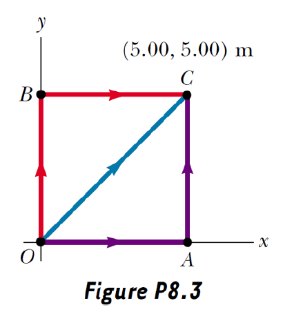
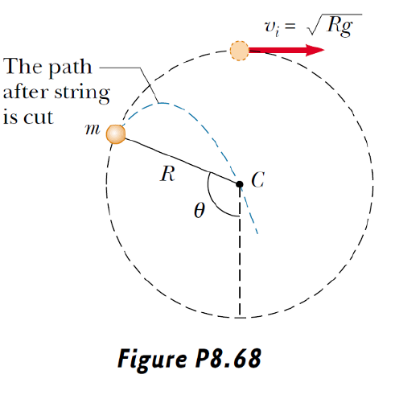
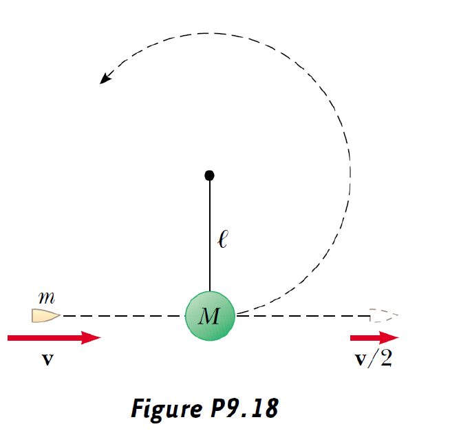
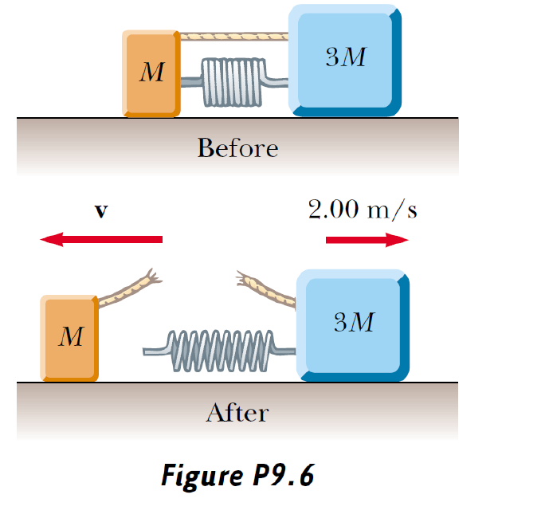
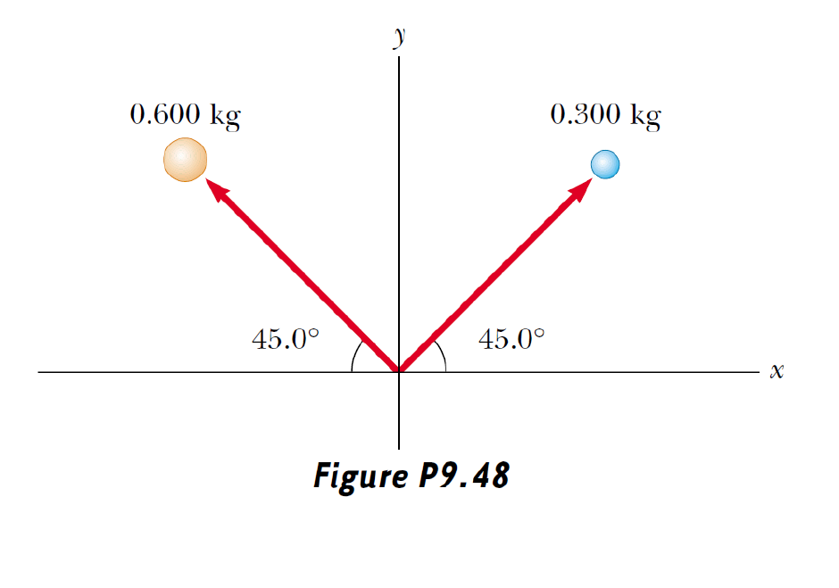
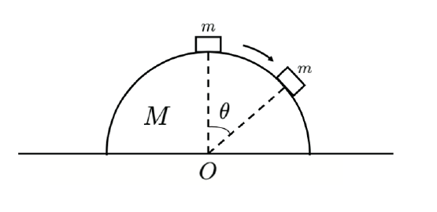
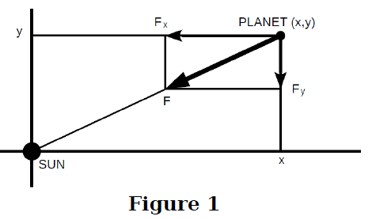
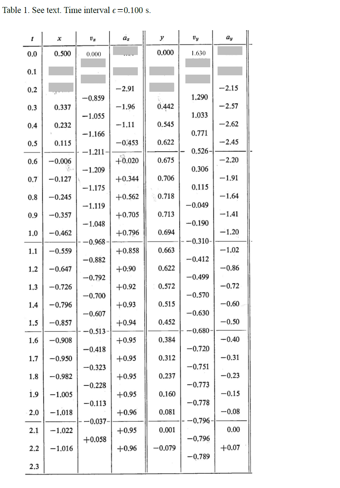

# Problem set #3

## 1

1. A force acting on a particle moving in the xy plane is given by $\mathbf{F} = (2y\mathbf{i} + x^{2}\mathbf{j})$ N, where x and y are in meters. The particle moves from the origin to a final position having coordinates $x = 5.00\,\mathrm{m}$ and $y = 5.00\,\mathrm{m}$, as in Figure P8.3. Calculate the work done by $\mathbf{F}$ along (a) OAC, (b) OBC, (c) OC. (d) Is $\mathbf{F}$ conservative or nonconservative? Explain.

(a)

OAC: $W_a=W_{OA}+W_{AC}=\int_{0}^5(x^2\bold j)(dx\bold i)+\int_0^5(2y\bold i+5^2\bold j)(dy\bold j)=125J$

(b)

OBC: $W_b=W_{OB}+W_{BC}=\int_0^5(2y\bold i)(dy\bold j)+\int_0^5(10\bold i+x^2\bold j)(dx\bold i)=50.0J$

(c)

OC: $W_c=W_{OC}=\int_0^5(2x\bold i+x^2\bold j)(dx\bold i+dx\bold j)=\dfrac{200}3J=66.7J$

$F$ is nonconservative, because the work done by it is different even if the starting point and the destination are the same.

## 2

2. A ball is tied to one end of a string. The other end of the string is fixed. The ball is set in motion around a vertical circle without friction. At the top of the circle, the ball has a speed of $v_{i} = \sqrt{Rg}$, as shown in Figure P8.68. At what angle $\theta$ should the string be cut so that the ball will travel through the center of the circle?

It's obvious that the desired cutting point would situate at the left-up part of the circle.

Let $\alpha=\theta-\dfrac\pi2$

$\dfrac12mv^2+mg(R+R\sin\alpha)=\dfrac12mv_i^2+2mgR$

This yields $v^2=gR(3-2\sin\alpha)$

$$
\begin{cases}
x=R\cos\alpha=v\sin\alpha\cdot t\\
y=R\sin\alpha=\dfrac12gt^2-v\cos\alpha\cdot t
\end{cases}
$$

Solving the equations above, we can get $\alpha=\arcsin\dfrac{3-\sqrt6}{3}$.

So $\theta=\dfrac\pi2+\arcsin\dfrac{3-\sqrt6}{3}$

## 3

3. As shown in Figure P9.18, a bullet of mass $m$ and speed $v$ passes completely through a pendulum bob of mass $M$. The bullet emerges with a speed of $v/2$. The pendulum bob is suspended by a stiff rod of length $\ell$ and negligible mass. What is the minimum value of $v$ such that the pendulum bob will barely swing through a complete vertical circle?

By using conservation of momentum, the speed of the pendulum bob $v_0$ when it's at the bottom satisfies $mv=Mv_0+m\dfrac v2$, so $v_0=\dfrac m{2M}v$.

To complete a vertical circle, the pendulum bob just has to pass the top.

Its speed at top $v_1$ is given by $\dfrac12Mv_1^2+2Mgl=\dfrac12Mv_0^2$.

To pass the top, $v_1\ge 0$.

Solving that inequality, we get $v\ge\sqrt{\dfrac{16M^2gl}{m^2}}$

## 4

4. Two blocks of masses $M$ and $3M$ are placed on a horizontal, frictionless surface. A light spring is attached to one of them, and the blocks are pushed together with the spring between them (Fig. P9.6). A cord initially holding the blocks together is burned; after this, the block of mass $3M$ moves to the right with a speed of $2.00\,\mathrm{m/s}$. (a) What is the speed of the block of mass $M$? (b) Find the original elastic energy in the spring if $M = 0.350\,\mathrm{kg}$.

(a)

Call the block with mass $M$ the block 1, the other the block 2.

By conservation of momentum, $-Mv_1+3Mv_2=0$, so $v_1=6.00m/s$

(b)

By conservation of energy, $E_{ela}=E_{k1}+E_{k2}=\dfrac12Mv_1^2+\dfrac12(3M)v_2^2=8.40J$

## 5

5. A billiard ball moving at $5.00\,\mathrm{m/s}$ strikes a stationary ball of the same mass. After the collision, the first ball moves at $4.33\,\mathrm{m/s}$ and at an angle of $30.0^{\circ}$ with respect to the original line of motion. Assuming an elastic collision (and ignoring friction and rotational motion), find the struck ball's velocity.

Suppose the two balls sit on the x-axis.

$$
\begin{cases}
mv_0=mv_1\cos\theta+mv_{2x}\\
0=mv_1\sin\theta-mv_{2y}
\end{cases}
$$

So $v_{2x}=1.25m/s,v_{2y}=2.17m/s$, $|v_2|=2.50m/s,\theta=\arctan\dfrac{v_{2y}}{v_{2x}}=60.0\degree$

## 6

6. Two masses, $0.600\,\mathrm{kg}$ and $0.300\,\mathrm{kg}$, begin uniform motion at the same speed, $0.800\,\mathrm{m/s}$, from the origin at $t = 0$ and travel in the directions shown in Figure P9.48. (a) Find the velocity of the center of mass in unit-vector notation. (b) Find the magnitude and direction of the velocity of the center of mass. (c) Write the position vector of the center of mass as a function of time.

(a)

$\vec{r_1}=-vt\cos\theta\bold i+vt\sin\theta\bold j$

$\vec{r_2}=vt\cos\theta\bold i+vt\sin\theta\bold j$

$\vec{r_m}=\dfrac{m_1\vec{r_1}+m_2\vec{r_2}}{m_1+m_2}=-\dfrac12vt\cos\theta\bold i+vt\sin\theta\bold j$

$\vec{v_m}=\dfrac{d\vec{r_m}}{dt}=-\dfrac12v\cos\theta\bold i+v\sin\theta\bold j=-0.283\bold i+0.566\bold j$

(b)

$|\vec{v_m}|=0.632m/s$

$\theta=\arctan-\dfrac{v_{my}}{v_{mx}}=\arctan 2$.

So it's direction is $\theta$ biased from negative-x-axis.

(c)

$\vec{r_m}(t)=-0.283t\bold i+0.566t\bold j$

## 7

7. A semisphere of mass $M$ and radius $R$ is put on a frictionless horizontal table and can move freely. A block of mass $m$ is located on the top of this semisphere. Initially both the semisphere and the block are at rest. Then the block is perturbed such that it starts to slide down the semisphere from rest. The block detaches the semisphere at angle $\theta$. Neglect the size of the block and the friction between the block and the semisphere.

(a) Find the angle $\theta$. (It is enough to give the equation in which $\theta$ is the only unknown quantity. You do not need to solve this equation if it is too complicated for you.)

(b) What is the value of $\theta$ when $m \ll M$ and $m \gg M$?

(a)

Let $v_x$ be the speed of the semisphere, $v$ be the speed of block relative to semisphere.

From conservation of momentum in x-axis, we gain $Mv_x+mv_x=mv\cos\theta$.

From conservation of energy, we gain $\dfrac12Mv_x^2+\dfrac12m(v^2+v_x^2-2vv_x\cos\theta)=mgR(1-\cos\theta)$.

From the detaching condition, we gain $mg\cos\theta=m\dfrac{v^2}R$

All of them together give $\dfrac m{m+M}\cos^3\theta-3\cos\theta+2=0$

(b)

When $m\ll M$, $\dfrac m{m+M}\approx 0$, so $\theta=\arccos\dfrac23$

When $m\gg M$, $\dfrac m{m+M}\approx1$, which yields $(\cos\theta-1)^2(\cos\theta+2)=0$, so $\theta=0$.

## 8. Motion of planet with Discrete Time Interval method

We consider the motion of a planet orbiting around the sun. We suppose that the sun is infinitely massive, so that we can neglect its motion. The gravity force $\vec{F}$ on the planet due to the sun is shown in Fig. 1. With the initial conditions given below, we choose for the planet its plane of motion to be the $x-y$ plane.

(a) Using Newton's second law and Newton's law of gravitation, write down the equation of motion for the planet in the $x$- and $y$-component forms. In the following, we set $GM = 1$, where $G$ is the gravitational constant, $M$ is the mass of the sun.

We will now determine its orbit with a discrete time interval method. It consists of the following steps:

$$
\vec{r}(t + \epsilon) = \vec{r}(t) + \epsilon \vec{v}(t + \epsilon/2),
$$
$$
\vec{v}(t + \epsilon/2) = \vec{v}(t - \epsilon/2) + \epsilon \vec{a}(t),
$$

where $\vec{r}(t), \vec{v}(t)$, and $\vec{a}(t)$ are the position, velocity and acceleration vectors describing the motion of the planet at time $t$, and where $\epsilon$ is a constant time interval that we choose to be $\epsilon = 0.100$ s.

An additional equation for setting up the initial velocity is needed: $\vec{v}(\epsilon/2) = \vec{v}(0) + (\epsilon/2)\vec{a}(0)$.

The initial values are given as follows:

$$
x(0) = 0.500,\quad y(0) = 0.000;\quad v_x(0) = 0.000,\quad v_y(0) = +1.630.
$$

Table 1 (see at the end of this problem) tabulates the positions at discrete time step, as well as a complete data of the corresponding velocity and acceleration of the planet.

(b) Following the discrete time interval method, fill in the missing data points in shaded boxes (12 boxes). In other words, find the position $\vec{r}(t)$ and all necessary information needed for its computation up to $t = 0.200$ s using the time interval $\epsilon = 0.100$ s. Write down clearly the steps on how you arrive at your answers.

(c) Using the information available in Table 1, make a plot of the orbit of the planet.

(d) Determine the period of the orbit. Determine the length of the semimajor axis (one half of the longest axis).

(e) Kepler's third law states that $T^2 = 4\pi^2 R^3 / GM$, where $T$ and $R$ are the period and the radius of the planet's orbit, respectively. Demonstrate that your answer in (d) agrees with Kepler's law.

(a)

Suppose $\vec{r}=(x,y)$.

$$
m\dfrac{d^2\vec{r}}{dt^2}=-\dfrac{GMm}{r^3}\vec{r}
$$

Rewrite it in xy-component form.

$$
\begin{cases}
\dfrac{d^2x}{dt^2}=-\dfrac{GMx}{(x^2+y^2)^{\frac32}}\\
\dfrac{d^2y}{dt^2}=-\dfrac{GMy}{(x^2+y^2)^{\frac32}}\\
\end{cases}
$$

(b)

$a_x(0)=-\dfrac{x}{(x^2+y^2)^{\frac32}}=-4.00$, $a_y(0)=-\dfrac{y}{(x^2+y^2)^{\frac32}}=0.00$, 

$v_x(0.05)=v_x(0)+0.05a_x(0)=-0.200$, $v_y(0.05)=v_y(0)+0.05a_y(0)=1.630$

$x(0.1)=x(0)+0.1v_x(0.05)=0.480, y(0.1)=y(0)+0.1v_y(0.05)=0.163$, $a_x(0.1)=-\dfrac{x(0.1)}{(x^2(0.1)+y^2(0.1)^{\frac32})}=-3.68, a_y(0.1)=-\dfrac{y(0.1)}{(x^2(0.1)+y^2(0.1))^{\frac32}}=-1.25$

$v_x(0.15)=v_x(0.05)+0.1a_x(0.1)=-0.568, v_y(0.15)=v_y(0.05)+0.1a_y(0.1)=1.505$

$x(0.2)=x(0.1)+0.1v_x(0.15)=0.423, y(0.2)=y(0.1)+0.1v_y(0.15)=0.313$

(c)

图略。

(d)

$\dfrac T2\approx 2.1$, so $T\approx 4.2$

$2a\approx 0.5-(-1.022)$, so $a\approx0.766$

(e)

$T^2\approx 17.64$

$\dfrac{4\pi^2R^3}{GM}=17.74$

They are approximately equal, so it agrees with Kepler's law.