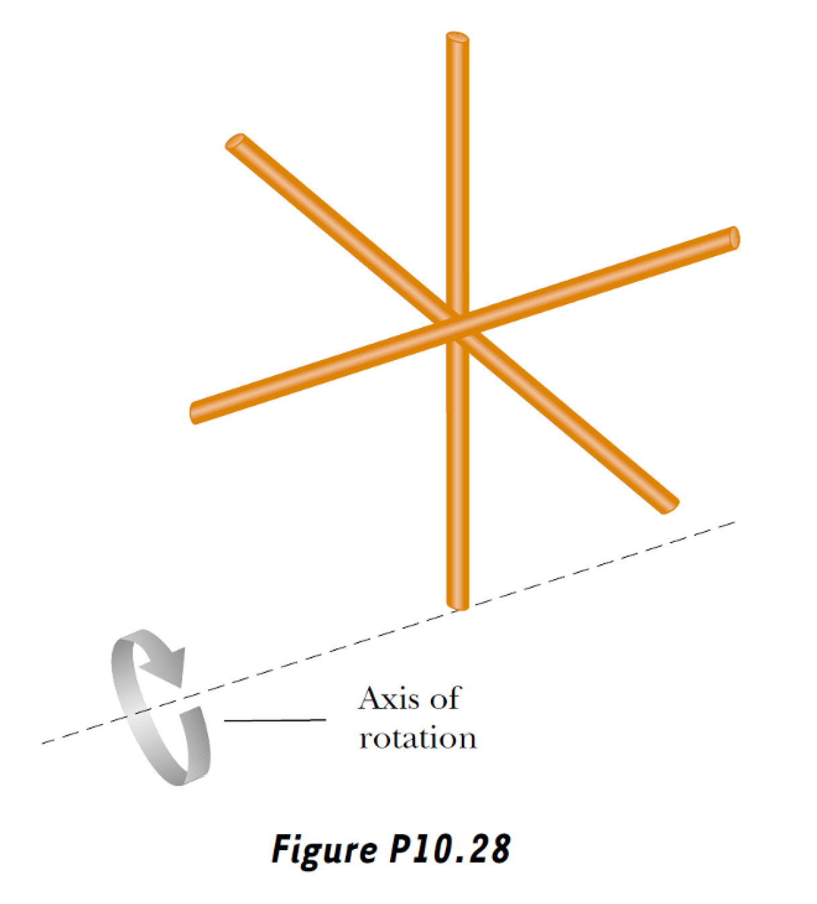
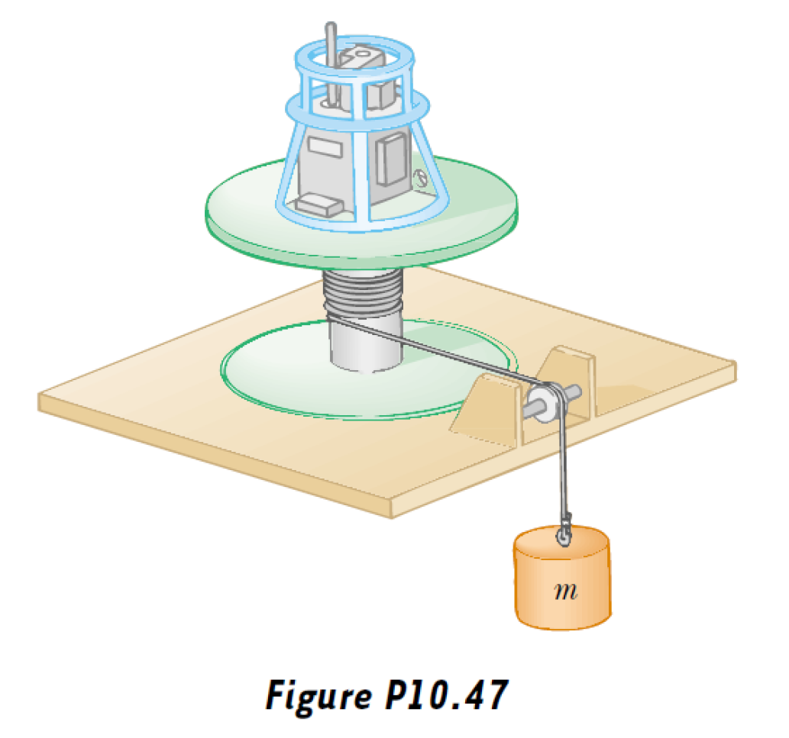
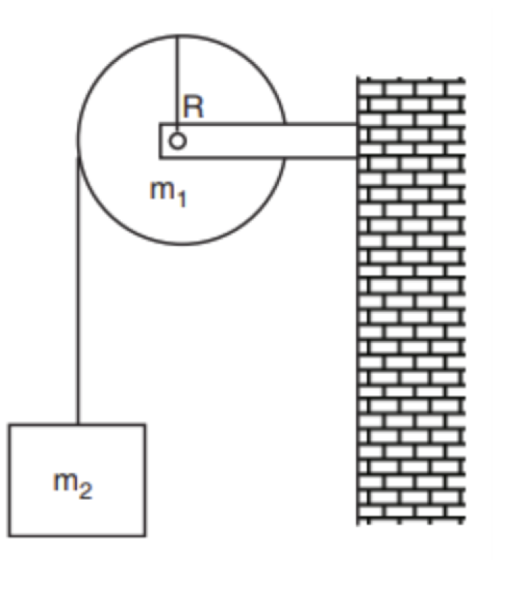

# Problem set #4

## 1

1. Three identical thin rods, each of length $L$ and mass $m$, are welded perpendicular to each other, as shown in Figure P10.28. The entire setup is rotated about an axis that passes through the end of one rod and is parallel to another. Determine the moment of inertia of this arrangement.

Let $\lambda=\dfrac mL$

$$
\begin{aligned}
I&=I_1+I_2+I_3\\
&=\int_0^L (\dfrac L2)^2\cdot\lambda dl+\int_0^L l^2\cdot\lambda dl+\int_{-\frac L2}^{\frac L2}((\dfrac L2)^2+l^2)\lambda dl\\
&=\dfrac14\lambda L^3+\dfrac13\lambda L^3+\dfrac13\lambda L^3\\
&=\dfrac{11}{12}\lambda L^3\\
&=\dfrac{11}{12}mL^2
\end{aligned}
$$

## 2

2. This problem describes one experimental method of determining the moment of inertia of an irregularly shaped object such as the payload for a satellite. Figure P10.47 shows a mass $m$ suspended by a cord wound around a spool of radius $r$, forming part of a turntable supporting the object. When the mass is released from rest, it descends through a distance $h$, acquiring a speed $v$. Show that the moment of inertia $I$ of the equipment (including the turntable) is $mr^2 (2gh / v^2 - 1)$.

Suppose the tension in the rope is $T$。

$$
rT=\tau=I\alpha\\
\alpha tr=v\\
ma=mg-T\\
at=v\\
mgh=\dfrac12 I(\alpha t)^2+\dfrac12mv^2
$$

From these, we can obtain $I=mr^2(\dfrac{2gh}{v^2}-1)$

## 3

3. (a) What is the rotational energy of the Earth about its spin axis? The radius of the Earth is $6370 \mathrm{km}$, and its mass is $5.98 \times 10^{24} \mathrm{kg}$. Treat the Earth as a sphere of moment of inertia $\frac{2}{5} MR^2$. (b) The rotational energy of the Earth is decreasing steadily because of tidal friction. Estimate the change in one day, given that the rotational period increases by about $10 \mu \mathrm{s}$ each year.

$(a)$

$$
E=\dfrac12I\omega^2=\dfrac12\cdot(\dfrac25MR^2)(\dfrac{2\pi}{T})^2=2.57\times10^{29}J
$$

$(b)$

$$
E=\dfrac{4\pi^2}5\cdot\dfrac{MR^2}{T^2}
$$

When $\Delta T$ is small, $\Delta E\approx\dfrac{dE}{dT}\Delta T=-\dfrac{8\pi^2}{5}\cdot\dfrac{MR^2}{T^3}\Delta T=-1.63\times10^{17}J$

## 4

4. A bicycle wheel has a diameter of 64.0 cm and a mass of 1.80 kg. Assume that the wheel is a hoop with all of its mass concentrated on the outside radius. The bicycle is placed on a stationary stand on rollers, and a resistive force of 120 N is applied tangent to the rim of the tire. (a) What force must be applied by a chain passing over a 9.00- cm- diameter sprocket if the wheel is to attain an acceleration of 4.50 rad/s²? (b) What force is required if the chain shifts to a 5.60- cm- diameter sprocket?

$(a)$

Suppose the force is $F$.

$$
\tau_1=-fr_1\\
\tau_2=Fr_2\\
\tau_1+\tau_2=I\alpha=(mr_1^2)\alpha\\
$$

So $F=872N$

$(b)$

Suppose the force $F'$

$$
\tau_1=-fr_1\\
\tau_2'=F'r_2'\\
\tau_1+\tau_2'=I\alpha=(mr_1^2)\alpha\\
$$

So $F'=1.40\times10^3N$

## 5

5. A student claims that she has found a vector A such that $(2\mathbf{i} - 3\mathbf{j} + 4\mathbf{k})\times \mathbf{A} = (4\mathbf{i} + 3\mathbf{j} - \mathbf{k})$. Do you believe this claim? Explain.

No.

The resulting vector should be perpendicular to the two operating vectors.

But it's not in this case.

## 6.

6. A uniform disk of mass $m_{1} = 4\mathrm{kg}$ and radius $R = 0.4\mathrm{m}$ can freely rotate about a fixed horizontal axis through the center of the disk, without friction between the axis and the disk, as illustrated in the Figure below. A body of mass $m_{2} = 2\mathrm{kg}$ is attached to the end of a length of inextensible string of negligible mass, and the other end of the string is wound around the edge of the disk.

(a) Show that the moment of inertia $I$ of the disk about the fixed axis is given by

$$
I = \frac{1}{2} m_{1}R^{2}
$$

(b) At a time $t = 0$, the body is released from rest at a height of 2 m above the ground. Assuming that the string does not slip over the disk, but causes the disk to rotate, find the tension $T$ in the string and the acceleration $a$ of the body. (Use $g = 9.8 \mathrm{~m} \cdot \mathrm{s}^{-2}$)  

(c) Using the derived value of the acceleration, find the velocity $v$ of the body just before it hits the ground.  

(d) Determine the velocity $v$ of the body just before it hits the ground by considering the conservation of energy.  

(e) If instead the mass of the body were much larger than that of the disk, what would be the acceleration of the body?

$(a)$

Suppose $\sigma=\dfrac {m_1}{\pi R^2}$

$$
I=\int r^2\sigma dS=\sigma\int_0^R(r^2)\cdot(2\pi r)dr=\dfrac12m_1R^2
$$

$(b)$

$$
TR=I\alpha\\
\alpha R=a\\
m_2a=m_2g-T
$$

So $T=\dfrac{m_1m_2g}{m_1+2m_2}=9.8N,a=\dfrac{2m_2g}{m_1+2m_2}=4.9m/s^2$

$(c)$

$$
v^2=2ah
$$

So $v=\sqrt{2ah}=4.4m/s$

$(d)$

$$
v=\omega R\\
m_2gh=\dfrac12 I\omega^2+\dfrac12m_2v^2
$$

So $v=\sqrt{\dfrac{4m_2gh}{m_1+2m_2}}=4.4m/s$

$(e)$

Of course $a\approx g=9.8m/s^2$ then.