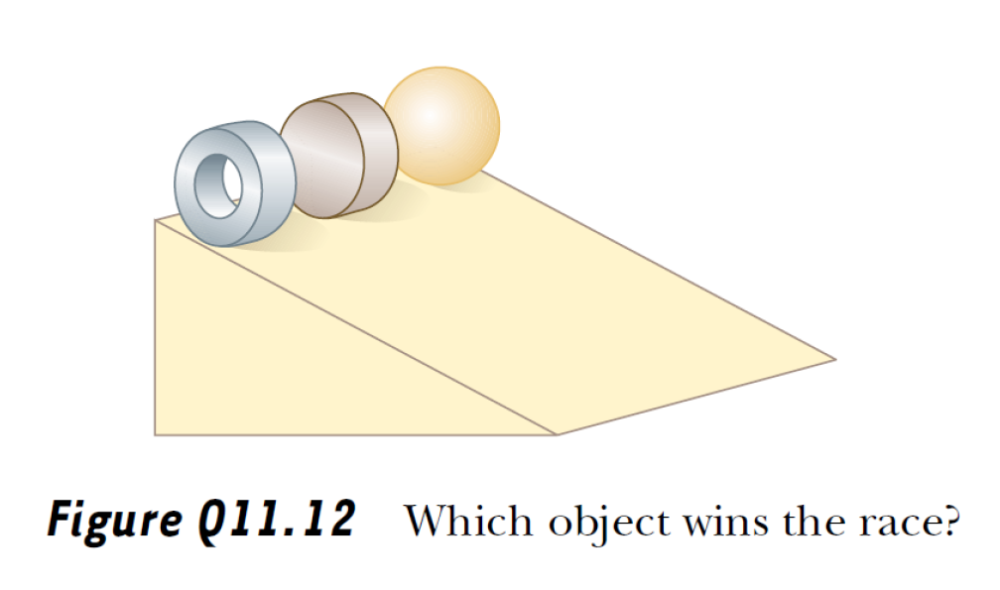
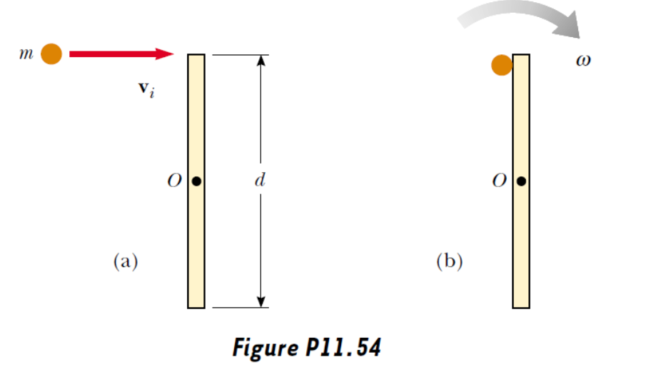
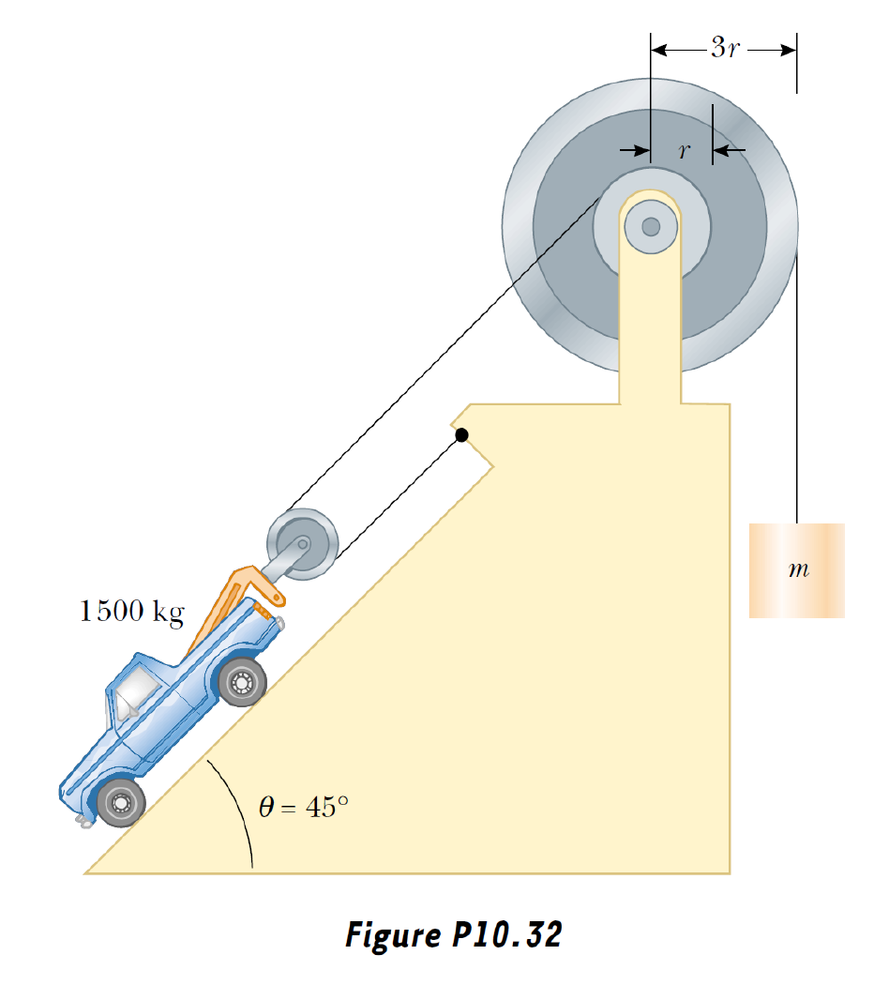
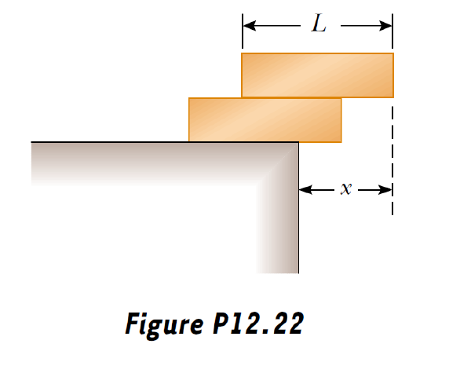
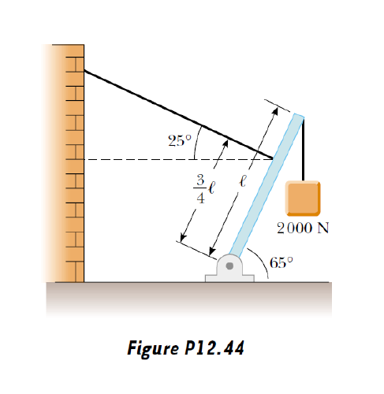
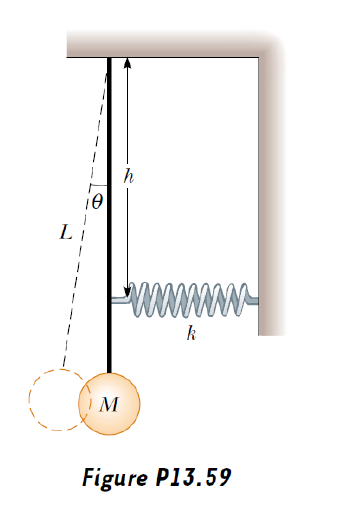
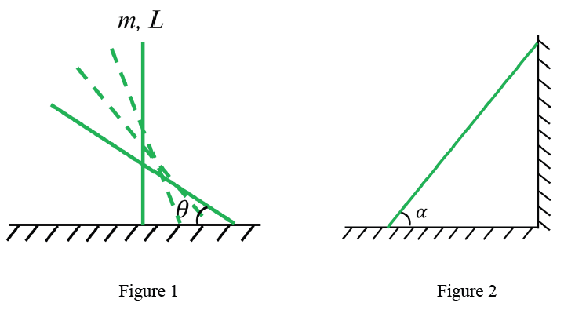

# Problem set #5

## 1

1. Three objects of uniform density—a solid sphere, a solid cylinder, and a hollow cylinder—are placed at the top of an incline (Fig. Q11.12). If they all are released from rest at the same elevation and roll without slipping, which object reaches the bottom first? Which reaches it last? You should try this at home and note that the result is independent of the masses and the radii of the objects.

For the center of mass, $mg\sin\theta-f=ma$

They roll without slipping, so $fR=I\alpha,\alpha R=a$

So $a=\dfrac{g\sin\theta}{1+\frac{I}{mR^2}}$.

We can caculate that for a solid sphere, $I=\dfrac25 mR^2$, for a solid cylinder, $I=\dfrac12mR^2$, for a hollow cylinder, $I=\dfrac12(1+\dfrac rR)^2mR^2>\dfrac12mR^2$.

So the order will be the hollow sphere, the solid cylinder, the hollow one.

## 2

2. A projectile of mass $m$ moves to the right with speed $v_{i}$ (Fig. P11.54a). The projectile strikes and sticks to the end of a stationary rod of mass $M$ and length $d$ that is pivoted about a frictionless axle through its center (Fig. P11.54b).  
   (a) Find the angular speed of the system right after the collision.  
   (b) Determine the fractional loss in mechanical energy due to the collision.

(a)

By conversation of angular momentum, $\dfrac d2mv_i=I\omega+\dfrac d2\cdot m\dfrac d2\omega$

We know $I=\dfrac1{12}Md^2$, so $\omega=\dfrac{6mv_i}{(M+3m)d}$

(b)

$E_i=\dfrac12mv_i^2$

$E_f=\dfrac12m(\omega\dfrac d2)^2+\dfrac12 I\omega^2$

$E_{loss}=E_i-E_f=\dfrac{Mmv_i^2}{2M+6m}$

$loss=\dfrac{E_i-E_f}{E_i}=\dfrac{M}{M+3m}$

## 3

3. Find the mass $m$ needed to balance the $1\,500\text{-kg}$ truck on the incline shown in Figure P10.32. Assume all pulleys are frictionless and massless.

Assume the tension in the rope to be $T$.

For the car: $2T-G\sin\theta=0$

For the big pulley: $rT-3r\cdot mg=0$

So $m=\dfrac{m\sin\theta}{6}=176.8kg$

## 4

4. A $60.0\text{-kg}$ woman stands at the rim of a horizontal turntable having a moment of inertia of $500\ \mathrm{kg \cdot m^2}$ and a radius of $2.00\ \mathrm{m}$. The turntable is initially at rest and is free to rotate about a frictionless, vertical axle through its center. The woman then starts walking around the rim clockwise (as viewed from above the system) at a constant speed of $1.50\ \mathrm{m/s}$ relative to the Earth.  
   (a) In what direction and with what angular speed does the turntable rotate?  
   (b) How much work does the woman do to set herself and the turntable into motion?

(a)

Let's assume counter-clockwise to be the positive.

By conservation of angular momentum, $0=-R\cdot mv+I\omega$

So $\omega=\dfrac{mvR}{I}=0.360rad/s$, counter-clockwise.

(b)

$W=E_f=\dfrac12mv^2+\dfrac12 I\omega^2=99.9J$

## 5

5. Two identical, uniform bricks of length $L$ are placed in a stack over the edge of a horizontal surface such that the maximum possible overhang without falling is achieved, as shown in Figure P12.22. Find the distance $x$.

When at the maximum status, the center of mass of any system above any edge must sits at the edge.

For the first block, this means $x_1=\dfrac L2$

For the second block, this means $\dfrac12((m(x_2-\dfrac L2)+mx_2)=0$, so $x_2=\dfrac L4$

$x=x_1+x_2=\dfrac34L$

## 6

6. A $1\,200\text{-N}$ uniform boom is supported by a cable, as illustrated in Figure P12.44. The boom is pivoted at the bottom, and a $2\,000\text{-N}$ object hangs from its top. Find the tension in the cable and the components of the reaction force exerted on the boom by the floor.

Suppose the tension be $T$, and the components of the reaction force be $F_x,F_y$.

$\dfrac34l\cdot T=G_1\cdot\dfrac l2\cos\alpha+G_2\cdot l\cos\alpha$

$\begin{cases}G_1+G_2=F_y+T\sin\theta\\ T\cos\theta=F_x\end{cases}$

$T=\dfrac{2G_1+4G_2}{3}\cos\alpha=1465N$

$F_x=1328N$

$F_y=G_1+G_2-T\sin\theta=2581N$

## 7

7. A pendulum of length $L$ and mass $M$ has a spring of force constant $k$ connected to it at a distance $h$ below its point of suspension (Fig. P13.59). Find the frequency of vibration of the system for small values of the amplitude (small $\theta$). (Assume that the vertical suspension of length $L$ is rigid, but neglect its mass.)

$\tau=\tau_F+\tau_G=Fh+G\cdot L\sin\theta=kh\theta\cdot h+Mg\cdot L\theta=(kh^2+MgL)\theta$

$\tau=I\beta$, so $\beta=\dfrac{kh^2+MgL}{ML^2}\theta$.

Solving this gives $T=2\pi\sqrt{\dfrac{kh^2+MgL}{ML^2}}$

## 8

8. **Rotation of a sliding rigid rod**  
   Consider a rod with mass $m$ and length $L$ standing straight on the frictionless ground. When we release the rod, it will fall from the unstable equilibrium position:  
   (a) Calculate the angular velocity of the rod, when it has an angle of $\theta$ with respect to the ground as illustrated in Figure 1.  
   (b) What is the final angular velocity $\omega_{1}$ of the rod before it hits the ground?  
   (c) If the same rod is leaning to a frictionless wall with an initial angle of $\alpha$ to the frictionless ground (see Figure 2), what is the final angular velocity $\omega_{2}$ of the rod before it hits the ground? Note that there is a possibility that the right end of the rod leaves from the wall before the rod hits the ground.

(a)

The velocity of the touching point must be horizontal.

The velocity of the center of mass must be vertical, because conversation of horizontal linear mometum.

So the instantaneous center can be spotted.

$v_{CM}=\omega\dfrac L2\cos\theta$

$E_k=\dfrac12mv_{CM}^2+\dfrac12I\omega^2=\dfrac{3\cos^2\theta+1}{24}mL^2\omega^2$

$E_k=\Delta E_h=mg(\dfrac L2-\dfrac L2\sin\theta)$

So $\omega=\sqrt{\dfrac{12(1-\sin\theta)g}{(3\cos^2\theta+1)L}}$

(b)

Let $theta=0$, then $\omega_1=\sqrt{\dfrac{3g}{L}}$

(c)

Suppose at degree $\theta_m$ the rod leaves the wall.

First analyze the phase when the rod sticks to the wall.

The center of mass moves along a circle whose center sits at the corner of the wall. So $v_{CM}=\dfrac L2\omega$.

So by conservation of energy $mgL(\dfrac12\sin\alpha-\dfrac12\theta)=\dfrac12mv_{CM}^2+\dfrac12I\omega^2$, which gives $\omega^2=\dfrac{3g}{L}(\sin\alpha-\sin\theta)$

Plus, $x_{CM}=-\dfrac L2\cos\theta$. When the rod is about to leave the wall, the wall does not provide support force to it. So $\ddot x_{CM}=0$, which gives $\omega^2\cos\theta_m+\dot\omega\sin\theta_m=0$

So $\sin\theta_m=\dfrac23\sin\alpha$

$v_x=v_{CM}\cdot\sin\theta_m=\dfrac{\sin\alpha}3\sqrt{gL\sin\alpha}$

Second analyze the phase after the rod leaves the wall.

For the center of mass, $v_{xf}=v_x$, $y_{CM}=\dfrac L2\sin\theta$, so $v_{yf}=\dfrac L2\cos(0)\omega_2=\dfrac{L\omega_2}2$

By conversation of energy, $mg\dfrac L2\sin\alpha=\dfrac12m(v_{xf}^2+v_{yf}^2)+\dfrac12I\omega_2^2$

So $\omega_2=\sqrt{\dfrac{g\sin\alpha}{3L}(9-sin^2\alpha)}$