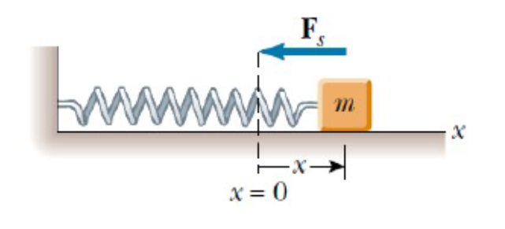
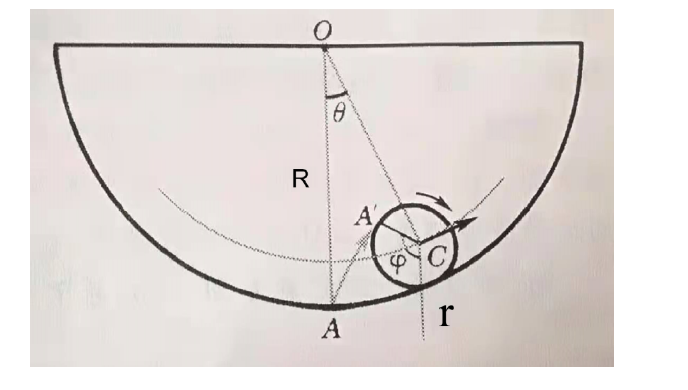
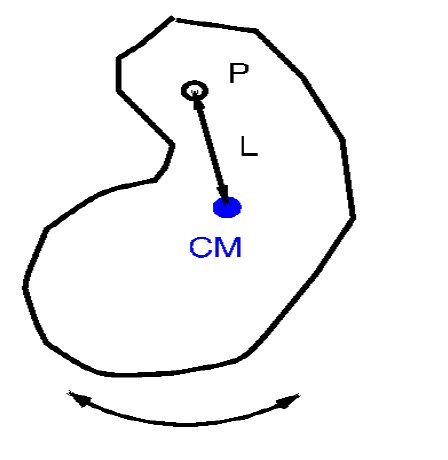
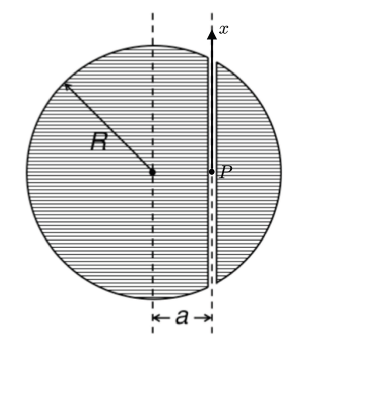
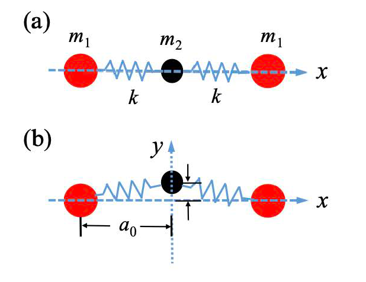

# Problem set #6

## 1

1. Consider a particle with mass $m$ attached to a massless spring with the force constant $k$ (see the figure below). Now the particle undergoes an oscillating motion around its equilibrium position. The position of the particle measured from the equilibrium position is denoted by $x$ and the momentum of the particle is denoted by $p$.  
   (a) Suppose the total energy of the particle is $E$. Plot the trajectory of the particle on the $x-p$ plane. (Take $x$ for the horizontal axis and $p$ for the vertical axis.) The values at the intersection with $x$- and $p$-axes should also be given in terms of $m, k$, and $E$.  
   (b) Suppose this spring is a special spring whose force constant $k$ can be varied. It is known that, if we change the external parameter sufficiently slowly, the area surrounded by the trajectory of the periodic motion in the $x-p$ plane is unchanged ("adiabatic theorem"). Suppose the particle undergoes an oscillatory motion with the energy $E_{\mathrm{i}}$ at the beginning, and then we change the force constant from $k_{\mathrm{i}}$ to $k_{\mathrm{f}}$ very slowly. Derive the energy of the particle $E_{\mathrm{f}}$ at the final state.

## 2

2. Consider a small cylinder with radius $r$ is having a pure rolling motion in a big hollow cylinder with radius $R$. If the rolling is limited to a small angle $\theta \ll 1$, the small cylinder will be in a harmonic oscillation:  
   (a) Calculate the potential energy of the small cylinder in $\theta$;  
   (b) Calculate the kinetic energy of the small cylinder in $d\theta/dt$;

## 3

3. (a) Let $x_{1}(t)$ and $x_{2}(t)$ be solutions of $\ddot{x}^{2} + bx = 0$. Show that $x_{1}(t) + x_{2}(t)$ is not a solution to this equation.  
   (b) Consider a physical pendulum formed by a rigid body of mass $m$ with the pivot $P$ around it performs frictionless oscillations and which is at a distance $L$ from the center of mass CM, see the sketch. The moment of inertia of the rigid body is $I_{p}$ with respect to the pivot. Derive the equation obeyed by small oscillations and find their frequency $\omega$.

## 4

4. A damped harmonic oscillator consists of a block ( $m = 2.00 \mathrm{kg}$ ), a spring ( $k = 10.0 \mathrm{N/m}$ ), and a damping force $F = bv$. Initially, it oscillates with an amplitude of $25.0 \mathrm{cm}$; because of the damping, the amplitude falls to three‑fourths of this initial value at the completion of four oscillations.  
   (a) What is the value of $b$?  
   (b) How much energy has been "lost" during these four oscillations?

## 5

5. Imagine that we have built a straight tunnel through a planet of mass $M$ and radius $R$. The vertical distance between the tunnel and the planet's center is $a$. At time $t = 0$, we drop a particle of mass $m$ into the tunnel from one end of the tunnel. The initial speed of the particle is zero. Assume the tunnel is frictionless and the density of the planet is uniform. Neglect the missing materials from the tunnel and the planet's rotation. The gravitational constant is $G$.

   (a) Calculate the gravity between the particle and the planet when the displacement of the particle from the middle point $P$ of the tunnel is $x$. The $x$-axis with $P$ as the origin has been given in the figure.  
   (Hint: If a particle is in a uniform spherical shell, it feels zero net gravity from the shell. If a particle is out of a uniform spherical shell, it feels nonzero net gravity from the shell as if the mass of the shell is concentrated at the sphere center.)

   (b) Express $x$ as a function of time $t$. How much time does the particle take to reach the other end of the tunnel?  
   (c) Analyze whether the speed of the particle in the tunnel can reach the first cosmic velocity of the planet if we properly choose $a$ when building the tunnel.

## 6

6. **Vibrational Modes of a Spring‑Ball System**

   Consider three balls connected by two identical springs, as shown in Figure (a). The two red balls have mass $m_{1}$ and the black ball has mass $m_{2}$. The spring constant of both springs is $k$. The force $F$ in each spring follows the Hooke's law. When the system is in equilibrium, the red balls are located at $x = \pm a_{0}$, and the black ball is located at $x = 0$.

   (a) Calculate three eigenfrequencies for longitudinal vibrational modes along the $x$ direction and illustrate the motion of the three balls in each normal mode.

   (b) For transverse vibrational modes, assume that the two red balls are stationary and fixed at $x = \pm a_{0}$, and the black ball oscillates in the $y$ direction with a small amplitude compared to the equilibrium distance $a_{0}$ [Figure (b)]. Calculate the restoring force acting on the black ball as a function of the perpendicular displacement $y$. Is this vibrational mode a harmonic motion? Explain the reason of your answer.

