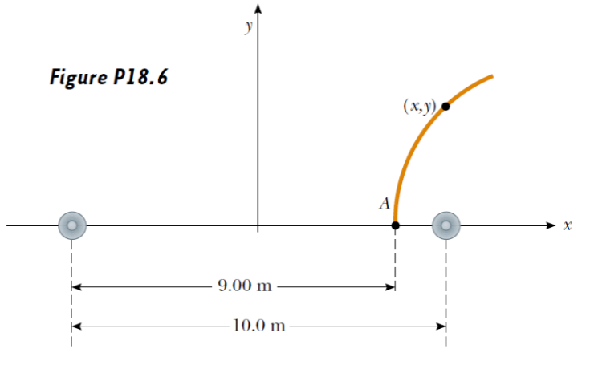
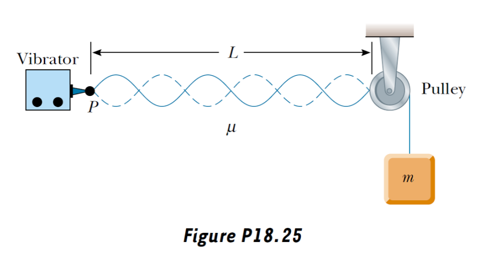
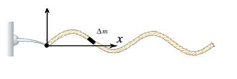
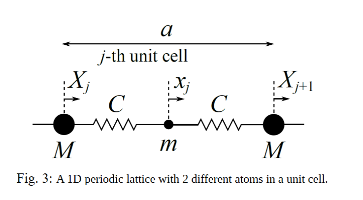

# Problem set #7

## 1

1. A sinusoidal wave traveling in the $- x$ direction (to the left) has an amplitude of $20.0 \mathrm{cm}$ , a wavelength of $35.0 \mathrm{cm}$ , and a frequency of $12.0 \mathrm{Hz}$ . The displacement of the wave at $t = 0$ , $x = 0$ is $y = - 3.00 \mathrm{cm}$ ; at this same point, a particle of the medium has a positive velocity. (a) Sketch the wave at $t = 0$ . (b) Find the angular wave number, period, angular frequency, and wave speed of the wave. (c) Write an expression for the wave function $y(x, t)$ .

(a)

Ignored.

(b)

angular wave number: $k=\dfrac{2\pi}{\lambda}\approx17.95rad/m$

angular frequency: $\omega=2\pi f=24\pi\approx75.40rad/s$

speed: $v=f\lambda=4.20m/s$

(c)

Assume $y(x,t)=A\cos(kx+\omega t+\varphi)$

We know when $x=0,t=0$，$y(x,t)=A\cos\varphi=-0.03$, so $\cos\varphi=-0.15$

$v(x,t)=\dfrac{\partial y}{\partial t}=-A\omega\sin(kx+\omega t+\varphi)$, let $x=0,t=0$, so $-A\omega\sin\varphi>0$, which mean $\sin\varphi<0$.

So $\varphi=-\arccos(0.15)\approx-1.722rad$

So $y(x,t)=0.200\cos(17.95x+75.40t-1.722)m$

## 2

2. An earthquake on the ocean floor in the Gulf of Alaska produces a tsunami (sometimes called a "tidal wave") that reaches Hilo, Hawaii, $4450 \mathrm{km}$ away, in a time of $9 \mathrm{h} 30 \mathrm{min}$ . Tsunamis have enormous wavelengths $(100 - 200 \mathrm{km})$ , and the propagation speed of these waves is $v \approx \sqrt{g d}$ , where $d$ is the average depth of the water. From the information given, find the average wave speed and the average ocean depth between Alaska and Hawaii. (This method was used in 1856 to estimate the average depth of the Pacific Ocean long before soundings were made to obtain direct measurements.)

$v=\dfrac st$

$v\approx\sqrt{gd}$

So $d\approx\dfrac{s^2}{gt^2}\approx1.73\times10^3m$

## 3

3. Two identical speakers 10.0 m apart are driven by the same oscillator with a frequency of $f = 21.5 \mathrm{~Hz}$ (Fig. P18.6). (a) Explain why a receiver at point $A$ records a minimum in sound intensity from the two speakers. (b) If the receiver is moved in the plane of the speakers, what path should it take so that the intensity remains at a minimum? That is, determine the relationship between $x$ and $y$ (the coordinates of the receiver) that causes the receiver to record a minimum in sound intensity. Take the speed of sound to be $343 \mathrm{~m} / \mathrm{s}$ .

(a)

$\lambda=\dfrac{v}{f}\approx16m$

The difference of distance from point A to two spreakers is $\Delta s=9-1=8m=\dfrac\lambda 2$

So the crest meets with the trough, they cancel each other, resulting in a minimum at A.

(b)

$\Delta s=\dfrac{2k-1}{2}\lambda$, because $2c=10.0m<\dfrac32\lambda$, so $k=\pm1$.

That gives us a hyperbola, $\dfrac{x^2}{\frac{\lambda^2}{16}}-\dfrac{y^2}{25-\frac{\lambda^2}{16}}=1$

## 4

4. A 2.00-m-long wire having a mass of 0.100 kg is fixed at both ends. The tension in the wire is maintained at 20.0 N. What are the frequencies of the first three allowed modes of vibration? If a node is observed at a point 0.400 m from one end, in what mode and with what frequency is it vibrating?

## 5

5. In the arrangement shown in Figure P18.25, a mass can be hung from a string (with a linear mass density of $\mu = 0.002 00 \mathrm{kg / m})$ that passes over a light pulley. The string is connected to a vibrator (of constant frequency $f$ ), and the length of the string between point $P$ and the pulley is $L = 2.00 \mathrm{m}$ . When the mass $m$ is either $16.0 \mathrm{kg}$ or $25.0 \mathrm{kg}$ , standing waves are observed; however, no standing waves are observed with any mass between these values. (a) What is the frequency of the vibrator? (Hint: The greater the tension in the string, the smaller the number of nodes in the standing wave.) (b) What is the largest mass for which standing waves could be observed?

## 6

6. Consider an oscillatory wave traveling on a string whose linear density (mass per unit length) is $\sigma$ . Introduce $x$ and $y$ coordinates as the horizontal and the vertical coordinates, respectively, and describe the wave by $y$ coordinate of the string at $x$ and time $t$ as $y = y(x,t)$ . Assume that the magnitude $F$ of the tension is constant throughout the string, and the amplitude of the oscillation is small.

(a) First, write down the equation of motion for the mass element $\Delta m$ of the string between $x$ and $x + \Delta x$ . Then, derive the wave equation for $y(x,t)$ with $F$ and $\sigma$ .

(b) Consider a traveling wave moving at the speed $c$ described by a wave function $y = y(x - ct)$ . From the wave equation obtained in (a), derive an expression of $c$ in terms of $F$ and $\sigma$ .

(c) Consider the following Galilean transformation from the original frame $K$ with $(x,t)$ to another inertial frame $K^{\prime}$ with $(x^{\prime},t^{\prime})$ moving against $K$ -frame at the relative velocity $V$ in the $x$ direction:

$$
\begin{aligned}
x'&=x-Vt\\
t'&=t
\end{aligned}
$$

Express $\partial /\partial x$ and $\partial /\partial t$ in terms of the variables in $K^{\prime}$ - frame, i.e., $\partial /\partial x^{\prime}$ and $\partial /\partial t^{\prime}$ .

(d) Using the result obtained in (c), derive the wave equation in $K^{\prime}$ -frame (i.e., write down the wave equation in terms of $x^{\prime}$ and $t^{\prime}$ ). Here, express the final result using $c$ instead of $F$ and $\sigma$ . Is the wave equation Galilean invariant?

(e) Discuss the physical meaning of $c$ : in which reference frame(s) is the wave speed equal to $c$ ?

## 7

7. Interference of waves in 2 dimensions

Two plane waves propagate in a homogeneous elastic medium, one along the $x$ axis and the other along the $y$ axis: $\xi_{1} = A\cos (\omega t - kx)$ and $\xi_{2} = A\cos (\omega t - ky)$ . Suppose the waves are transverse with the same oscillation direction.

(a) Determine the location of the nodes in the $x - y$ plane.

(b) Determine the location of the antinodes in the $x - y$ plane.

(c) Provide a sketch of the wave motion pattern.

(d) Do you expect a different wave motion pattern in the case of longitudinal waves? (In order to justify your answer, describe the difference between transversal and longitudinal waves and link it to the expected wave motion pattern.)

## 8

8. Phonon as Lattice Vibrations

Consider a one- dimensional periodic lattice with two different atoms (with mass $M$ and $m$ such that $M > m$ ) in a unit cell with the lattice constant $a$ (Fig. 3). Assume that the neighboring atoms are connected by a spring with the spring constant $C$ . We shall discuss lattice vibration modes called "phonons".

(a) As shown in Fig. 3, displacement of the atoms with mass $M$ and $m$ in the $j$ -th unit cell from their equilibrium positions is denoted by $X_{j}$ and $x_{j}$ , respectively. Derive equations of motion of $X_{j}$ and $x_{j}$ .

(b) Consider normal modes in the form of $X_{j} = X_{m a x} e^{i(k j a - \omega t)}$ and $x_{j} = x_{m a x} e^{i(k j a - \omega t)}$ , where $k$ is the wave number, $\omega$ is the angular frequency, and $X_{m a x}$ and $x_{m a x}$ are the amplitudes of the oscillation of $X_{j}$ and $x_{j}$ , respectively. Derive $\omega^{2}$ as a function of $k$ .

(c) Draw a schematic picture of the atomic motion at $k = 0$ and $\pi /a$ for each mode (i.e., four pictures in total).

