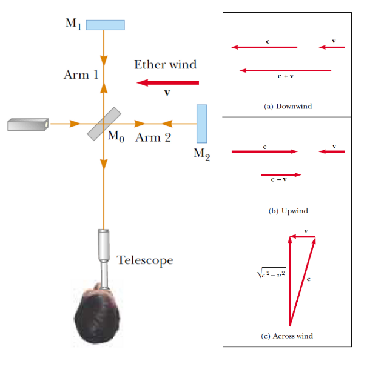
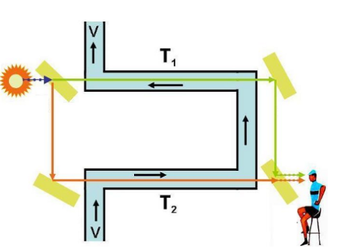

# Problem set #8

## 1

1. Expectant parents are thrilled to hear their unborn baby's heartbeat, revealed by an ultrasonic motion detector. Suppose the fetus's ventricular wall moves in simple harmonic motion with an amplitude of $1.80 \mathrm{mm}$ and a frequency of 115 per minute. (a) Find the maximum linear speed of the heart wall. Suppose the motion detector in contact with the mother's abdomen produces sound at $2,000,000.0 \mathrm{Hz}$ , which travels through tissue at $1.50 \mathrm{km / s}$ . (b) Find the maximum frequency at which sound arrives at the wall of the baby's heart. (c) Find the maximum frequency at which reflected sound is received by the motion detector. (By electronically "listening" for echoes at a frequency different from the broadcast frequency, the motion detector can produce beeps of audible sound in synchronization with the fetal heartbeat.)

$(a)$

$x=A\sin(\omega t+\varphi),\omega=2\pi f$

$v=A\omega\cos(\omega t+\varphi), v_{max}=A\omega=2.17\times10^{-2}m/s$

$(b)$

By Dopler's effect, $f'=f_{sound}\cdot\dfrac{v_{sound}+v_{receiver}}{v_{sound}}$

So $f'_{max}=f_{sound}\cdot\dfrac{v_{sound}+v_{max}}{v_{sound}}=2000029Hz$

$(c)$

$f''=f'\cdot\dfrac{v_{sound}}{v_{sound}-v_{sender}}$

So $f''_{max}=f'_{max}\cdot\dfrac{v_{sound}}{v_{sound}-v_{max}}=2000058Hz$

## 2

2. In this problem we understand the details of the Michelson-Morley experiment under classical physics, whose result was, of course, not observed experimentally. As shown in the left panel, arm 2 is aligned along the direction of the ether wind flowing past the Earth at speed $v$ . Assume $c$ is the speed of light in the ether frame, and the velocity addition rules are illustrated in the right panel. The two beams reflected from M1 and M2 recombine, and an interference pattern consisting of alternating dark and bright fringes is formed. Assume that the two arms of the interferometer have equal length $L$ . Show that the time difference between light traveling along arm 1 and arm 2 is

$$\Delta t \approx L v^2 /c^3$$

However, Michelson and Morley detected no fringe shift due to the path difference that corresponds to this time difference.

Along arm 1, $t_1=\dfrac{2L}{\sqrt{c^2-v^2}}$

Along arm 2, $t_2=\dfrac{L}{c+v}+\dfrac{L}{c-v}$

$\Delta t=|t_1-t_2|=\dfrac Lc|\dfrac{2}{\sqrt{1-(\frac vc)^2}}-\dfrac1{1+\frac vc}-\dfrac1{1-\frac vc}|\approx\dfrac Lc(2(1+\dfrac12(\dfrac vc)^2-((1-\dfrac vc)+(1+\dfrac vc))))=\dfrac{Lv^2}{c^3}$

## 3

3. In class we derived the velocity addition law based on the principle of the constancy of the speed of light and the principle of relativity. We analyzed two races between a ball with a pulse of light (a photon in quantum mechanics), one with the train at rest on the track and another with a moving train (see illustrations in the lecture notes). Follow the lecture notes and derive the following addition law

$$\frac{c - w}{c + w} = \left(\frac{c - u}{c + u}\right)\left(\frac{c - v}{c + v}\right)$$

where $c$ is the speed of light in vacuum, $u$ the speed of the ball with respect to the train, $v$ the speed of train with respect to the track, and $w$ the speed of the ball with respect to the track. For your own benefit, please write down explicitly the frame of the reference during your derivation, and pay attention to when the two principles are used.

In K' frame, suppose at $t'=0,x'=0$ the ball and the light starts at the leftmost end.

At $t'=\dfrac{L_0}{c}$, the light hits the mirror (event A), the ball at some place (event B).

When the light meets the ball (event C), suppose the distance portion is $(1-f):f$, so $t'=\dfrac{(1+f)L_0}c$, and $\dfrac uc=\dfrac{1-f}{1+f}$, so $f=\dfrac{c-u}{c+u}$.

In K frame, when $t=0,x=0$ the ball and the light starts at the leftmost end.

At $t=\dfrac{L}{c-v}=T_0$, the light hits the mirror (event A), the ball at some place (event B'). Suppose their distance is $D$.

At $t=\dfrac{L}{c-v}+\dfrac{fL}{c+v}=T_0+T_1$, the light meets the ball (event C).

So we get $\begin{cases}D=cT_0-wT_0\\ D=cT_1+wT_1\end{cases}$, $\dfrac{T_0}{T_1}=\dfrac{c+w}{c-w}$.

But $\dfrac{T_0}{T_1}=\dfrac{c+v}{f(c-v)}$ and $f=\dfrac{c-u}{c+u}$.

So $\dfrac{c-w}{c+w}=\dfrac{c-u}{c+u}\dfrac{c-v}{c+v}$.

## 4

4. Show that the relativistic velocity addition law in Question 3 is equivalent to

$$w = \frac{u + v}{1 + \left(\frac{u}{c}\right)\left(\frac{v}{c}\right)}$$

Consider the case we throw a very big elastic ball with velocity $u$ at a very small one at rest, as discussed in class. In the nonrelativistic case, the small ball moves off with velocity $2u$. What is the result, if $u=\dfrac c2$, i.e. half the speed of light in vaccum? Show that no matter how fast the big ball is thrown at it, the small ball always moves away at less than the speed of light.

Solve $w$ from the euqation in Question 3 gives $w=\dfrac{u+v}{1+\frac uc\frac vc}$

In frame K', the small ball moves at velocity $-u$, and will move at $u$ after collision.

Because $M>>m$, so after collision, the big ball still moves at $u$.

By our formula, the velocity of the small ball relative to the ground is $w=\dfrac{u+u}{1+\frac{u^2}{c^2}}$.

When $u\le c$, we know $w=\dfrac{2u}{1+\frac{u^2}{c^2}}=\dfrac{2}{\frac1u+\frac{u}{c^2}}\le c$.

When $u=\dfrac c2$, $w=\dfrac45c$

## 5

5. In this problem we show that the relativistic velocity addition law can be used to explain the Fizeau experiment without invoking the existence of ether. The speed of light in stationary water is less than its speed $c$ in vacuum. Traditionally it is written as $c / n$ , where $n \approx 4 / 3$ is the index of refraction of water. The water flowed in the pipe with velocity $v$ . In the lower arm T2 of the interferometer (as shown in the figure), one would expect that, from the nonrelativistic addition law, the speed of light in the moving water would be its speed in stationary water increased by the speed of the water in the pipe $w = c / n + v$ . Show that the relativistic velocity addition law leads to, up to higher- order corrections,

$$w = \frac{c}{n} + v\left(1 - \frac{1}{n^2}\right)$$

The result was observed by Fizeau in 1851, but for long time viewed as a confirmation of a rather elaborate contemporary ether- theoretical calculation based on the idea that the water was partially successful in dragging ether along with it. Einstein later said that it was of fundamental importance in his thinking.

In frame K' where the water is static, $v_{light}'=\dfrac cn$.

So by our formula, the speed of light in K frame is $v_{light}=\dfrac{v+v_{light}'}{1+\frac vc\frac{v_{light}'}c}=(v+\dfrac cn)(1+\dfrac v{cn})^{-1}\approx(v+\dfrac cn)(1-\dfrac v{cn})\approx\dfrac cn+v(1-\dfrac1{n^2})$