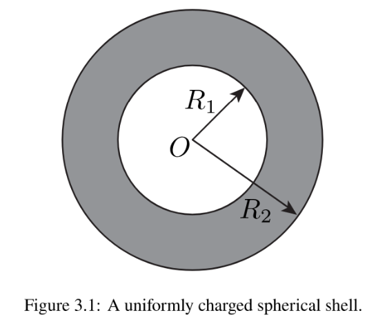

# Problem set #2

## chap03

> **2.** Given the electric potential $V = V_{0}\exp [-(x^{2} + y^{2} + az) / a^{2}]$, where $V_{0} > 0$ is a constant potential and $a > 0$ a constant length, calculate the electric field $\mathbf{E}$ at $\mathbf{r} = (x,y,z)$.

We know

$$
\begin{aligned}
\vec E&=-\nabla V\\
&=-(\dfrac{\partial}{\partial x}V,\dfrac{\partial}{\partial y}V,\dfrac{\partial}{\partial z}V)\\
&=(\dfrac{2V_0x}{a^2}e^{-(x^2+y^2+az)/a^2},\dfrac{2V_0y}{a^2}e^{-(x^2+y^2+az)/a^2},\dfrac{V_0}{a}e^{-(x^2+y^2+az)/a^2})
\end{aligned}
$$

> **4.** Consider a spherical shell with inner radius $R_{1}$ and outer radius $R_{2}$, as shown in the figure below. The shell is uniformly charged with a charge density of $\rho$. Assume that the electric potential is zero at infinity. Calculate the electric potential at any distance $r$ from the origin.

Due to symmetry and Gauss' Law,

When $r>R_2$, $\dfrac{\frac43\pi (R_2^3-R_1^3)\rho}{\epsilon_0}=\int\vec E\cdot d\vec s=4\pi r^2E$, so $\vec E(r)=\dfrac{(R_2^3-R_1^3)\rho}{3r^2\epsilon_0}\hat r$

$V(r)=\int_r^{+\infty} E(s)ds=-\dfrac{(R_2^3-R_1^3)\rho}{3\epsilon_0}\int_r^{+\infty}\dfrac{ds}{s^2}=\dfrac{(R_2^3-R_1^3)\rho}{3\epsilon_0r}$

When $R_1\le r\le R_2$, $\dfrac{\frac43\pi(r^3-R_1^3)\rho}{\epsilon_0}=\int \vec E\cdot d\vec s=4\pi r^2E$, so $\vec E(r)=\dfrac{\rho(r^3-R_1^3)}{3\epsilon_0r^2}\hat r$.

$V(r)=\int_r^{+\infty}E(s)ds=(\int_r^{R_2}+\int_{R_2}^{+\infty})E(s)ds=\int_r^{R_2}\dfrac{\rho(s^3-R_1^3)}{3\epsilon_0s^2}ds+\dfrac{(R_2^3-R_1^3)\rho}{3\epsilon_0R_2}=\dfrac{\rho}{6\epsilon_0}(3R_2^2-r^2-\dfrac{2R_1^3}{r})$

When $0\le r<R_1$, $\vec E(r)=0$.

$V(r)=\int_r^{+\infty}E(s)ds=(\int_r^{R_1}+\int_{R_1}^{R_2}+\int_{R_2}^{+\infty})E(s)ds=\dfrac{\rho}{2\epsilon_0}(R_2^2-R_1^2)$

In summary,

$$
V(r)=
\begin{cases}
\dfrac{\rho}{2\epsilon_0}(R_2^2-R_1^2), &0\le r<R_1\\
\dfrac{\rho}{6\epsilon_0}(3R_2^2-r^2-\dfrac{2R_1^3}{r}), &R_1\le r\le R_2\\
\dfrac{\rho(R_2^3-R_1^3)}{3\epsilon_0r}, &r>R_2\\
\end{cases}
$$

> **7.** Take the electrostatic field to be
>
> $$\mathbf{E}(x,y,z) = \frac{E_0}{a} (y\hat{x} +x\hat{y})$$
>
> everywhere, where the constants $E_0 > 0$ and $a > 0$ are a field strength and a length, and choose $V = 0$ at the origin.
>
> (a) Find the potential $V$ at the point $P = (x,y,0)$ by integrating along the path $(0,0,0)\rightarrow (x,0,0)\rightarrow (x,y,0)$, and again along the path $(0,0,0)\rightarrow (0,y,0)\rightarrow (x,y,0)$. Show that the two paths give the same result.
>
> (b) Find the equipotential curve in the $xy$ plane that passes through $(a,a,0)$, keeping only the branch that contains this point. Show that $\mathbf{E}$ is perpendicular to this curve at every point on it.

(a)

Path 1:

$V(P)=-(\int_0^x\dfrac{E_0}{a}x'\hat y\cdot\hat xdx'+\int_0^y\dfrac{E_0}{a}(y'\hat x+x\hat y)\cdot\hat ydy')=-\dfrac{E_0}{a}xy$

Path 2:

$V(P)=-(\int_0^y\dfrac{E_0}{a}y'\hat x\cdot\hat ydy'+\int_0^x\dfrac{E_0}{a}(y\hat x+x'\hat y)\cdot\hat xdx')=-\dfrac{E_0}{a}xy$

(b)

The curve is $xy=a^2(x,y>0)$, the direction vector of its tangent line at point $(x_0,y_0)$ is $\vec l=(x_0,-y_0)$, and $\vec E\cdot\vec l=0$, so they're perpendicular.

## chap04

> **2.** An electric potential is given in Cartesian coordinates:
>
> $$V = A(x^{2} + y^{2}) + Bz^{2},$$
>
> where $A$ and $B$ are positive constants.
>
> (a) Find the electric field $\mathbf{E}$.
>
> (b) Show that the electric field satisfies the fundamental property $\nabla \times \mathbf{E} = 0$.
>
> (c) Find the charge density $\rho (x,y,z)$ using the differential form of Gauss' law $\nabla \cdot \mathbf{E} = \rho /\epsilon_{0}$.

> **5.** Take the electrostatic field, in a region that contains the box of part (b), to be
>
> $$\mathbf{E}(x,y,z) = E_0\left[\left(1 + \frac{xy}{a^2}\right)\hat{x} +\frac{x^2}{2a^2}\hat{y}\right],$$
>
> where $E_0 > 0$ is a field strength and $a > 0$ a length.
>
> (a) Use $\nabla \cdot \mathbf{E} = \rho /\epsilon_0$ to find the charge density $\rho (x,y,z)$. Evaluate both $\rho$ and $\mathbf{E}$ at the origin.
>
> (b) Let $S$ be the closed surface of the rectangular box $0\leq x\leq a$, $0\leq y\leq b$, $0\leq z\leq c$, where $b > 0$ and $c > 0$ are lengths, with its normal pointing outward. Calculate the total electric flux $\Phi$ through $S$ directly from its six faces.
>
> (c) Calculate the enclosed charge $q_{\mathrm{enc}}$ by integrating $\rho$ over the whole box, and verify Gauss' theorem of Sec. 4.2 and Gauss' law, $\Phi = q_{\mathrm{enc}} / \epsilon_0$.

